theme: Letters from Sweden, 2
autoscale: true
build-lists: true

# [fit] *The State Of*
# [fit] _**Machine Learning**_
# [fit] *in iOS 13*

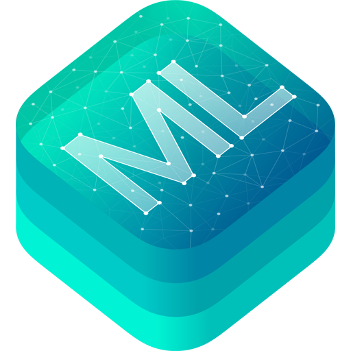

##  
## __*Federico Zanetello*__

★★★★★ [_fivestars.blog_](http://fivestars.blog) *•* [_@zntfdr_](http://twitter.com/zntfdr)

[.header-strong: #000]
[.text-emphasis: #000]
[.text-strong: #000]
[.text: #000]
[.header-emphasis: #ffffff]

^Today I’m here to talk about Machine Learning: 
it’s a topic that I haven’t had a chance to play with much previously, and it has always fascinated me. 
You might be asking…at least when I started this journey I did….

---

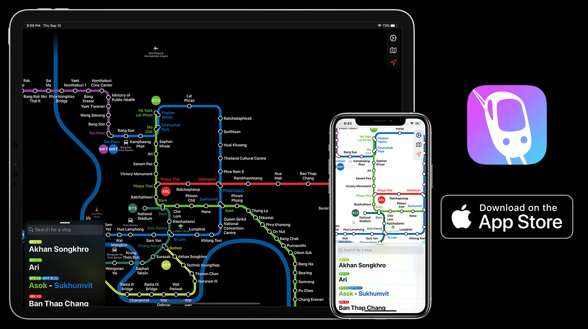

---

# [fit] *The State Of*
# [fit] _**Machine Learning**_
# [fit] *in iOS 13*

##  
## __*Federico Zanetello*__

★★★★★ [_fivestars.blog_](http://fivestars.blog) *•* [_@zntfdr_](http://twitter.com/zntfdr)

[.header-strong: #000]
[.text-emphasis: #000]
[.text-strong: #000]
[.text: #000]
[.header-emphasis: #ffffff]

^Today I’m here to talk about Machine Learning: 
it’s a topic that I haven’t had a chance to play with much previously, and it has always fascinated me. 
You might be asking…at least when I started this journey I did….

---

# [fit] *Why care? 🤔*

^…why should I care? 
As developers, most of our daily job is fetching data, animate transitions and filling tables.
However, Machine learning has been used within iOS for many years, exclusively at Apple first, and then, since iOS 11 (2017), Apple has released the first Machine Learning related framework called Core ML.
It is used across Apple's products including Siri, Camera, the Photos.app, Quick Type, and much more.
Machine learning is becoming every day more important, but you don’t have to believe me, I’m going to give you a reel of reasons in the upcoming slides: starting with…

---

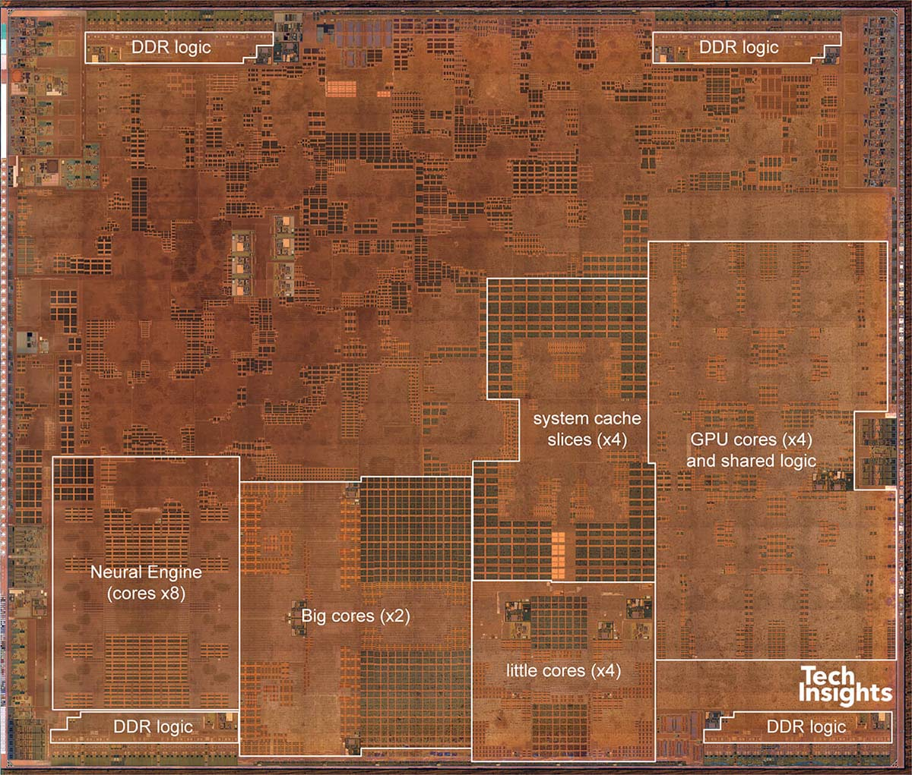
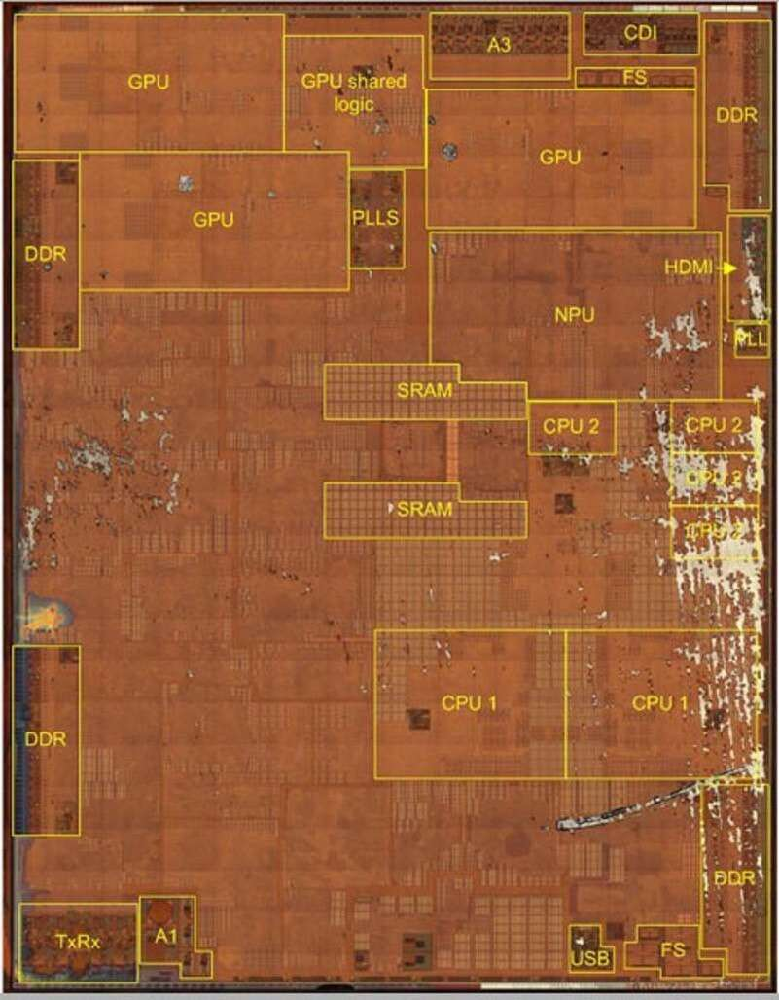

^not only software, but since the iPhone X (2017, iOS 11) Apple has shipped devices with a Neural Engine, also known as NPU. This includes the latest Apple watch series 4.
A11 and A12 in the picture.
A11 stats:
8-core architecture.
600 billion operations per second.
A12 stats:
8-core architecture.
5 trillion operations per second.
Core ML runs Up to 9x faster than A11 Bionic.
A13 stats:
8-core architecture.
? trillion operations per second.
Core ML runs Up to 20% faster and uses up to 15% less power than A12 Bionic.

---

### WWDC 2017
### _**4**_ videos, _**~150**_ minutes
###  
## WWDC 2018
## _**7**_ videos, _**~250**_ minutes
##  
# WWDC 2019
# _**15**_ videos, _**~400**_ minutes

^To make a comparison: 
- ARKit only had 3 sessions this year.
- Combine only two session.
- SwiftUI 11 sessions 450 minutes.

---

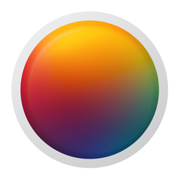

^not only that, but out of 9 of this year Apple Design winners, 3 apps were heavily using Machine Learning.
Butterfly iQ https://apps.apple.com/us/app/butterfly-iq-ultrasound/id1183035589
Pixelmator Photo https://apps.apple.com/us/app/pixelmator-photo/id1444636541 
HomeCourt https://apps.apple.com/us/app/homecourt-the-basketball-app/id1258520424 

^Batterfly iQ is a probe used for body ultrasound imaging. The app uses ML to guide the user in taking a diagnosable picture/video of the patient heart.

---

## AI _**➡**_ Software _**➡**_ World

^As developers we love to delete code, especially untested and undocumented code.
Machine Learning lets us remove tons of code, both on the client side and the backend side.

---

^Always remember that our focus should be to bring our users delight.
While we as developers think about architectures, and shipping the next version, we should always remember that.
Using Machine Learning we can easily bring our apps to the next level.
I will give you examples of this on the talk.

---

^
Cool! I hope I’ve convinced you that ML is a big deal and, if we really care about our users, we should start thinking about ways that we can use it to give our users the best experience.
And this brings me back to Apple:
Apple has been using ML for quite a long time, we can't tell exactly since when because of its secrecy, but we know that they've been hiring experts and publishing papert on AI/ML since at least 2015. 
Every year Apple uses ML more and more, and I don't expect this to change anytime soon. 
Better yet, Apple every year is making all these features available to 3rd party developers as well. 
Apple provides four Domain Specific frameworks and one general-purpose framework Let's look at them: (next slide)

---

# [fit] Vision 
Face detection
Face features detection
Text, bar code, shape detection
Object tracking
Image classification
Object detection
Attention image saliency
Objectness image saliency
Image similarity

^
Images and videos
Saliency talk with me after this session
Image classification
Object tracking

---

# [fit] Natural
# [fit] Language

Sentiment Analysis
Word Tagging
Word Embedding
Text Classification
Translation

^
Natural Language Processing (NLP)
Word Tagging =  process of marking up a word in a text (corpus) as corresponding to a particular part of speech, based on both its definition and its context
Word Embedding (goes hand-in-hand with image similarity) = vector representation of words. Similar words get clustered together.

---

# [fit] Speech &
# [fit] SoundAnalysis

Speech recognition (live or prerecorded)
Transcriptions
Alternative interpretations
Over 50 languages supported
Jitter, shimmer analysis
Pitch, voicing analysis

Sound classification

^Jitter is a measure of frequency instability, while shimmer is a measure of amplitude instability.
Basically can measure if the person is chilling or panicking.

^Pitch measures the frequency characteristics, voicing determine voiced regions (their wideness).
Basically can measure if the person is active or tired, length of pauses.

---

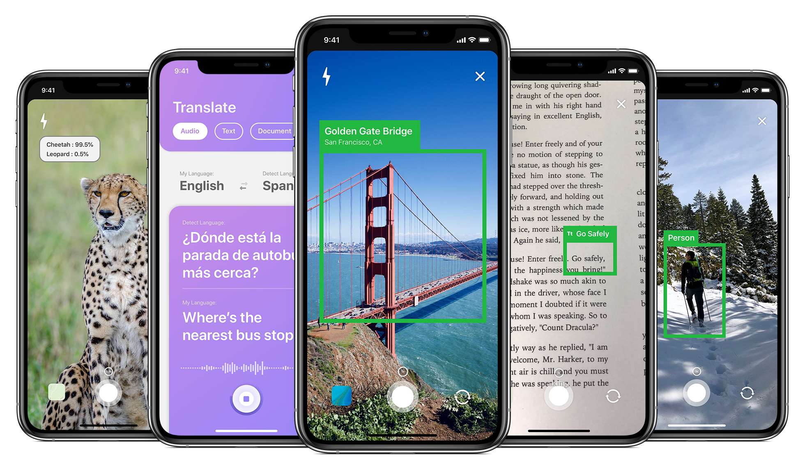

^
What can we do with these frameworks?
A lot, it’s important to realize that the real power of ML doesn’t stand in a single framework, but in the integration between multiple frameworks, machine-learning related or not. An example is ARKit and Core ML.
However the three frameworks just mentioned don’t fit everybody’s needs, what do we in this case?
We need to go a lever deeper and user Core ML

---

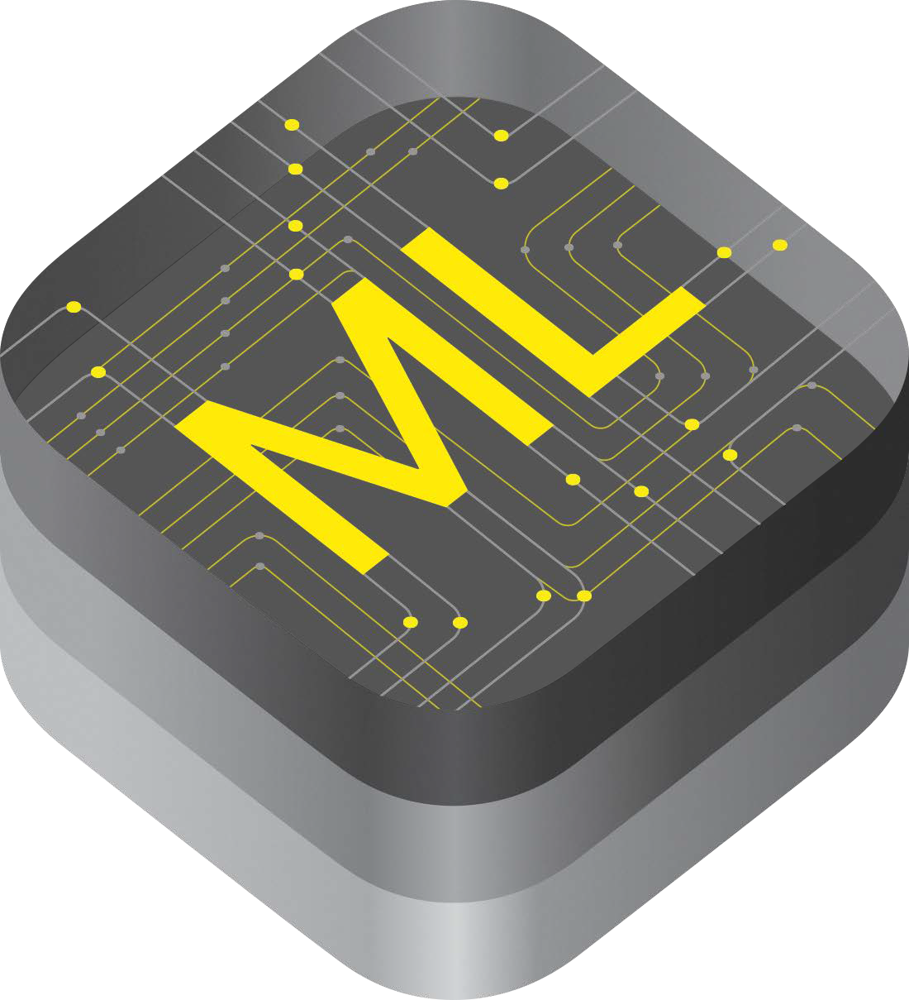

^All of the above is absolutely cool, however those are Domain Specific
 Frameworks, applications that Apple has implemented for us to use, but what about other apps needs that don't fit the criterai above? For those there's Core ML.

^Core ML is the foundational machine learning framework from Apple that builds on top of Accelerate, BNNS, and Metal Performance Shaders. It provides machine learning models that can be integrated to iOS applications and supports image analyses, natural language processing, audio to text conversion, and sound analysis. Applications can take advantage of Core ML without the need to have a network connection or API calls because the Core ML framework works using on-device computing.

^Predicting text
^Music Tagging

^
In traditional software, we define functions as a block of code that takes an input and returns as an output.
In Machine learning, instead of closures we have models that still receive an input and returns an output along with confidence and more.

^Therefore, with machine learning, instead of writing functions we need to design and train our models.
Until recently, this required at least some coding beside gathering all our training data.
Well, this year Apple tries to make things easier with the launch of a new app called Create ML.

---

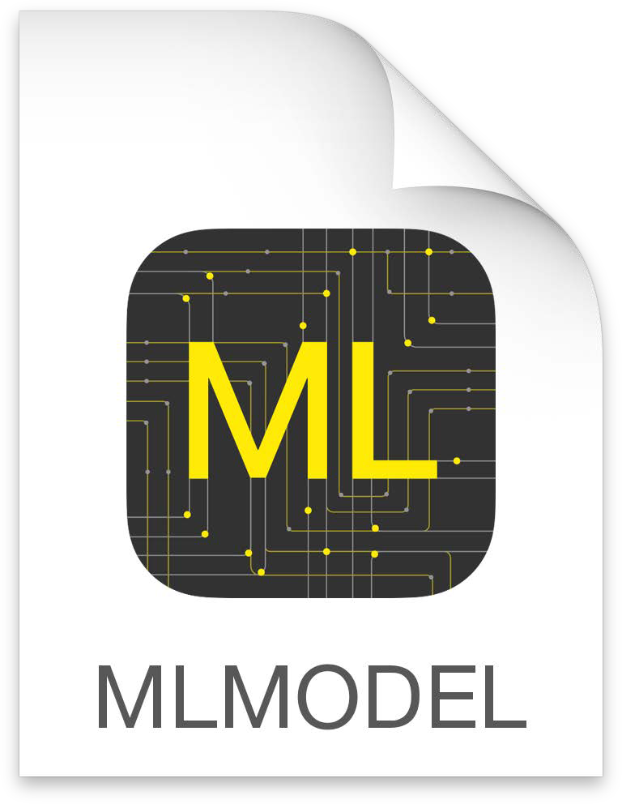

^In Machine Learning the function that we give input to get an output is called a model. for iOS this model is called MLModel.

---

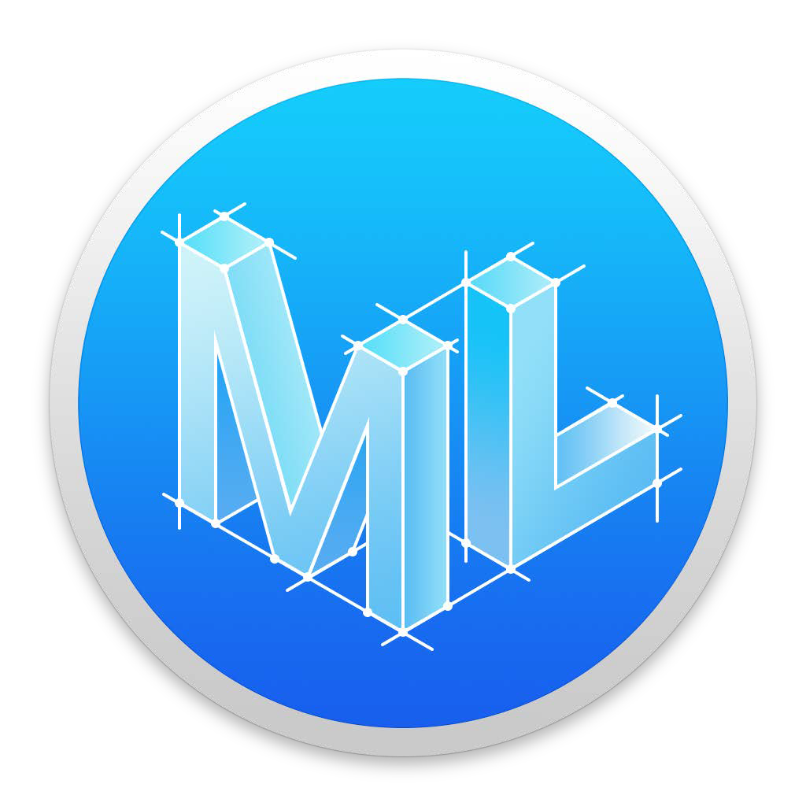

^Until Xcode 10, creating our own models meant use the CreateML framework to do so, use the Turi Create open source tool, or transform other Machine Learning models using coremltools.

^All of this requires coding, which is suboptimal to most busy people. Therefore this year Apple has released Create ML (requires macOS Catalina), which is an Xcode companion app.

^Create ML App makes creating models incredibly easy, and it brings most of the information required like accuracy, number of classes confidence.

^It also makes testing very easy as it connects with your phone to take pictures, record audio etc.

---

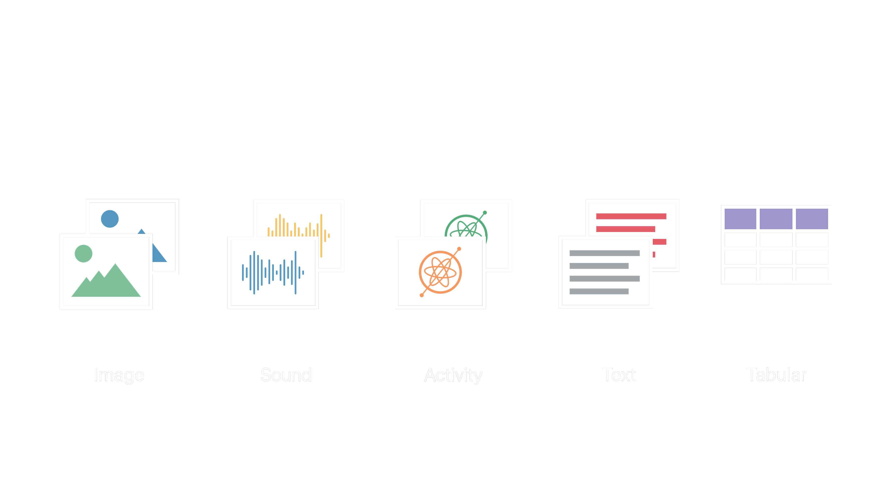

^What can we create with Create ML?

^Images 
- Image classifier
  An Image Classifier can be used for categorizing images based on their contents. 
For example, the Art Style identifier uses a custom Image Classifier to determine the most likely movement of a piece.
- Object Detector
  Lets you identify multiple objects within an image.

---

^Sounds
- Sound Classifier
  Determines the most dominant sound within an audio stream.

---

^Activity
- Activity classifier
  Puts together data from accelerometer and gyroscope to guess the type of activity the user is doing.

---

^Text

- Text classifier 

  Can be used to label sentences, paragraphs, or even entire articles based on their contents.
  Can be trained to recognize ad-hoc topics, identification/categorization tasks.

^

- Word tagger

  Ideal for labeling tokens or words of interest in text. 
General purpose examples of this are things like tagging different parts of speech or recognizing named entities.

---

^Tabular
- Tabular Regressor
  Regressors predicts the output value using training data.
- Classifier/Recommender
:
  A classifier groups the output of your data into classes or labels.

---

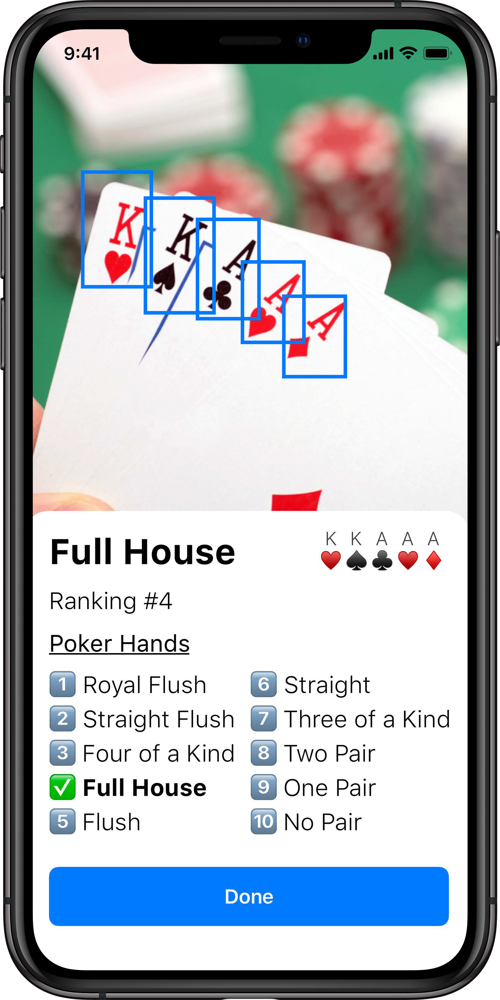
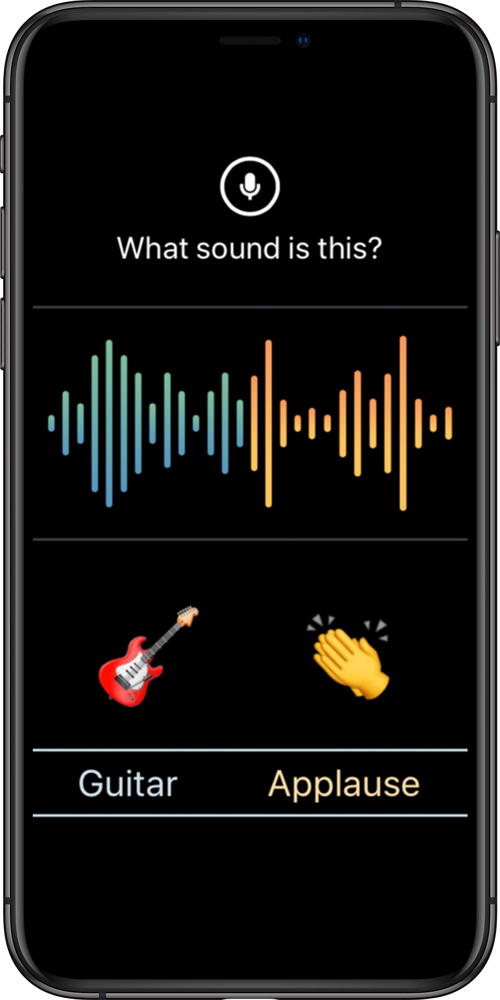
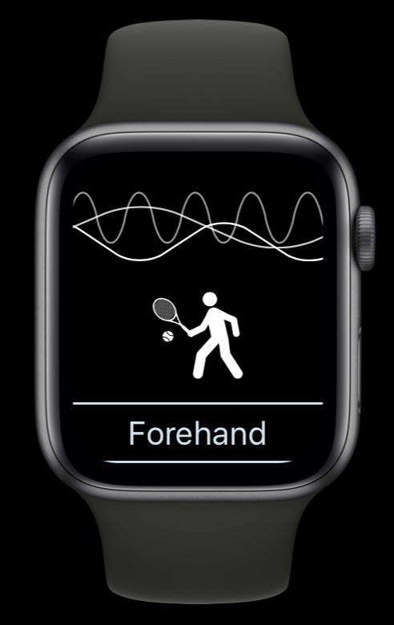
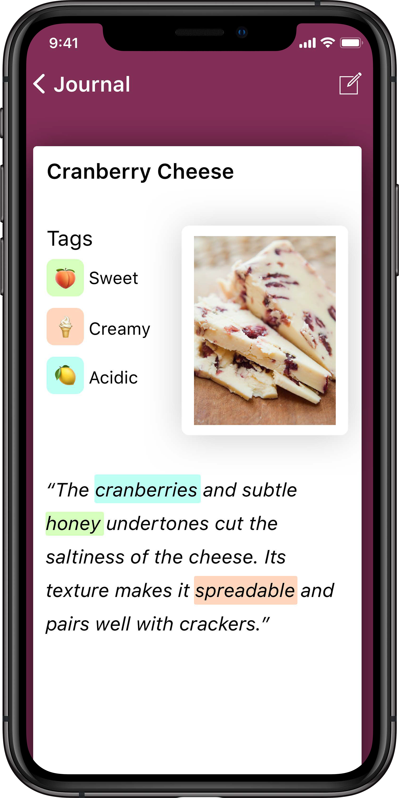

---

# [fit] On-device
# [fit] Training

^Custom model for each user, custom reccomendation for each user, custom drawing recognition etc, all local, update the model with the BackgroundTasks framework.

^maximum privacy, no server costs, always available.

---

# [fit] Examples?

FaceID
iOS Keyboard & QuickType
Photos.app
Hey Siri & Siri
Watch
Maps.app
Store.app
Safari.app
ARKit

^In the iOS keyboard, Apple increases or decreases the target tap area of the keyboard buttons based on the word you're most likely to type.
Quick Type guesses the word you're typing and what you're going to type next.

^In Photos, Machine learning helps people create albums, edit photos and search for specific memories.
Searching for pictures based on what's in a picture (e.g. dog) changes how we engage with our memories. The search even suggest word completion, suggest categories to search in.
Cropping a picture: at the beginnig iOS will crop and rotate the pic for you, then you edit it and the app will learn about it.
When showing pictures, the app uses objectness saliency to focus on the most important part of the picture, it doesn't not simply fit the picture or zoom to the center.

^Siri suggestions are a model constantly learning the more you use it for suggestions and activities. This is very obvious especially when you use the Siri Watch Face in the Apple Watch.


^The Apple Watch Series 4 Health Monitor uses ML to detect heart problems and Falls.

^Maps offers multiple routes, and the proposed routes are distinct by attributions (fastest, alternate, ..).

^App Store 
On the App Store, the app recommends you other apps based on your past behaviour (and it shows it to the user with a text like “Recommended based on apps you downloaded”)

^Safari.app
When opening a new tab, Safari now now suggests new article based on the past browsing history

^ARKit
The new people occlusion feature is actually Core ML doing people segmentation and depth estimation.
The new Motion Capture also use ML

---

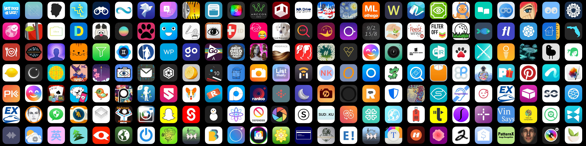

^
Those were just Apple examples but really there are hundreds if not thousands of apps in the store that already use Machine Learning.
I suggest you to start exploring where in your app your users could benefit for such intelligence, maybe start with something Complementary and Invisible at first, and then more and more adopt it with more confidence as your confidence with the Machine Learning tools grows.
I suggest you to choose one of the many fields seen today and focus on that one, watch the related WWDC sessions, read the Human Interface Guidelines, use the documentation sample projects and then go from there.
Thank you!

---

# [fit] Credits &
# [fit] Resources
[_developer.apple.com/machine-learning_](https://developer.apple.com/machine-learning/)
[_developer.apple.com/documentation/createml_](https://developer.apple.com/documentation/createml/)
[_github.com/apple/turicreate_](https://github.com/apple/turicreate)
[_github.com/apple/coremltools_](https://github.com/apple/coremltools)
[_developer.apple.com/design/human-interface-guidelines/machine-learning_](https://developer.apple.com/design/human-interface-guidelines/machine-learning/overview/introduction/)
[_techinsights.com_](https://www.techinsights.com/)
[_developer.apple.com/videos/all-videos_](https://developer.apple.com/videos/all-videos)

^https://www.techinsights.com/blog/apple-iphone-8-plus-teardown
^https://www.techinsights.com/blog/apple-iphone-xs-max-teardown

^https://developer.apple.com/videos/play/wwdc2017/710/
https://developer.apple.com/videos/play/wwdc2017/703/
https://developer.apple.com/videos/play/wwdc2017/208/
https://developer.apple.com/videos/play/wwdc2017/506/

^https://developer.apple.com/videos/play/wwdc2018/609/ 
https://developer.apple.com/videos/play/wwdc2018/703/ 
https://developer.apple.com/videos/play/wwdc2018/708/ 
https://developer.apple.com/videos/play/wwdc2018/709/ 
https://developer.apple.com/videos/play/wwdc2018/712/ 
https://developer.apple.com/videos/play/wwdc2018/713/ 
https://developer.apple.com/videos/play/wwdc2018/717/ 

^https://developer.apple.com/videos/play/wwdc2019/209/
https://developer.apple.com/videos/play/wwdc2019/222/
https://developer.apple.com/videos/play/wwdc2019/256/ 
https://developer.apple.com/videos/play/wwdc2019/228/ 
https://developer.apple.com/videos/play/wwdc2019/232/
https://developer.apple.com/videos/play/wwdc2019/234/ 
https://developer.apple.com/videos/play/wwdc2019/420/ 
https://developer.apple.com/videos/play/wwdc2019/424/ 
https://developer.apple.com/videos/play/wwdc2019/425/ 
https://developer.apple.com/videos/play/wwdc2019/426/ 
https://developer.apple.com/videos/play/wwdc2019/427/ 
https://developer.apple.com/videos/play/wwdc2019/428/ 
https://developer.apple.com/videos/play/wwdc2019/430/ 
https://developer.apple.com/videos/play/wwdc2019/704/ 
https://developer.apple.com/videos/play/wwdc2019/803/

[.text-emphasis: #4FFFB7]

---

# [fit] *The State Of*
# [fit] _**Machine Learning**_
# [fit] *in iOS 13*

##  
## __*Federico Zanetello*__

★★★★★ [_fivestars.blog_](http://fivestars.blog) *•* [_@zntfdr_](http://twitter.com/zntfdr)

[.header-strong: #000]
[.text-emphasis: #000]
[.text-strong: #000]
[.text: #000]
[.header-emphasis: #ffffff]