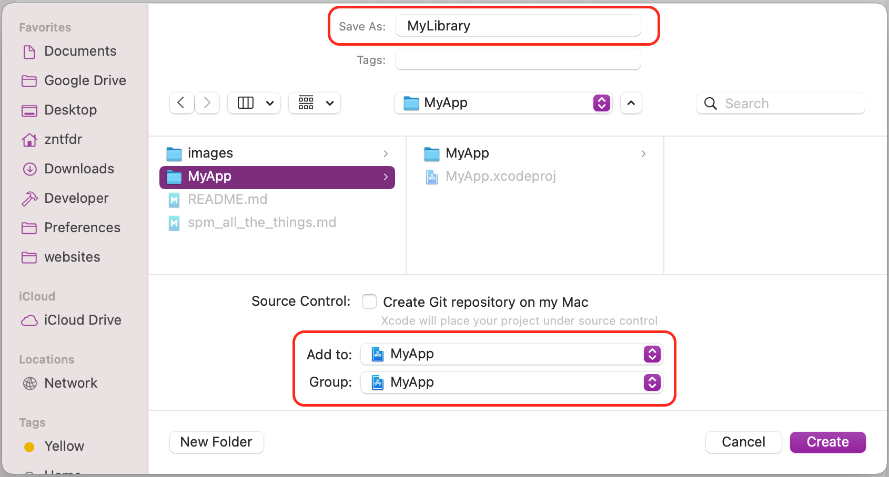
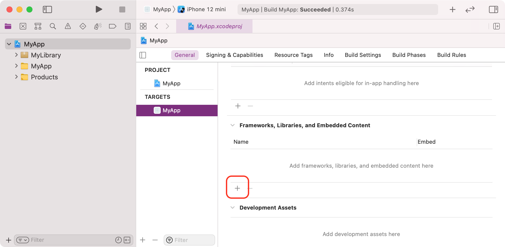
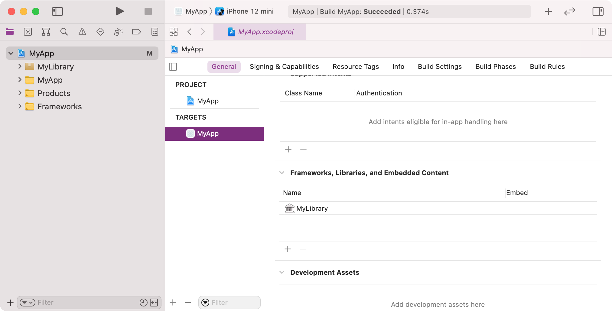
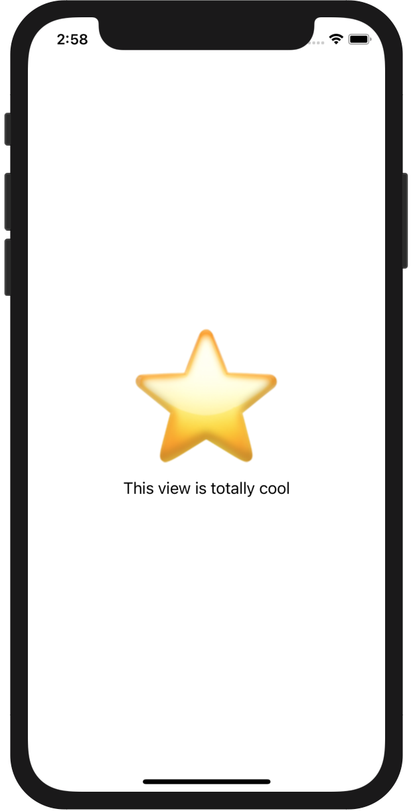
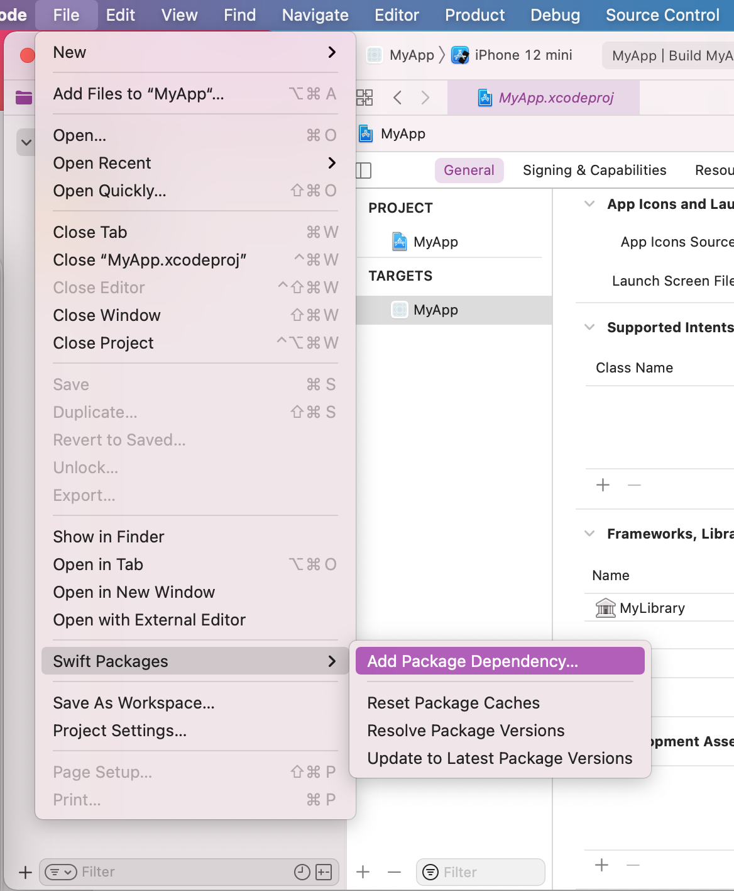

theme: Libre, 4
autoscale: true
build-lists: true

## <br>

# [fit] Swift Package 
# [fit] all the things! 📦

## <br><br><br>

## __*Federico Zanetello*__

## ★★★★★ [**fivestars.blog**][fivestarsblog] *•* [**@zntfdr**][twitterHandle]

^Hi! My name is .. and I'm iOS Developer living and working here in Bangkok.

---

# <br>
# <br>

# [fit] fivestars.blog ⭐️

# [fit] WWDCNotes.com 📝

# [fit] Bangkok Metro 🚇

^I also have a blog called .., where I share interesting things on SwiftUI and other things
^I'm part of the wwdc notes community, which is a community effort on writing notes for all wwdc sessions from all years.
^Lastly I'm also a indie developer building Bangkok metro, I know some of you use it daily, thank you very much for that!

---

# [fit] What's a Swift Package?

- New way to build frameworks
- Swift project since 2015
- Xcode 11 ❤️ iOS Apps
- Swift, Objective-C, Objective-C++, C, or C++
- Can bundle code, binaries, assets, ...

^in short it's the new way to build frameworks

---

# [fit] Why should we use one?

- modularization
- single-responsibility
- testability
- share between different projects/platforms
- blessed by 
- fun
- easy to use
- ...much more

^The gains are similar to frameworks, without their complexity
Every package can have its own suit of tests

---

# [fit] Getting 
# [fit] Started

^Alright! Hope to have convinced you! Time to get started!

---

# [fit] MyApp


---

# [fit] Create a Swift Package

1. Open your project
2. File > New > Swift Package...
3. Name it and add it to your project

^3 steps

---

# [fit] Create a Swift Package (1/2)


---

# [fit] Create a Swift Package (2/2)



^A new window will show up

---

###### [fit] Done! 🤩


^ Awesome! At this point our Project navigator should look like this
Now we have an app and a package
we need to tell Xcode that we want to add this new package as a dependency to our app

---

# [fit] Add Package to your App

1. Open app Project Editor 
2. Add the package under `Frameworks, Libraries, and Embedded Content`

^two steps

---


# [fit] Add Package to your App (1/2)



^Select the project name in the project navigator
Select the right target into the project editor
Click + on the `Frameworks, Libraries, and Embedded Content` section

---

# [fit] Add Package to your App (2/2)


---

###### [fit] Done! 🤩



^Now that everything is ready, let's have a look at what this package is

---

# The Package Structure

[.code-highlight: all]


[.code-highlight: 7-11]
^The `Tests` folder contains our test targets.

[.code-highlight: 4-6]
^The `Sources` folder contains our products targets. 

[.code-highlight: 5, 8]
^Two default targets
Each target representation is a folder:
all files within that folder belongs to that specific target, and every file can access to all other declarations within that folder.

[.code-highlight: 2]
^Lastly, we have the most important file, the `Package.swift` declaration. Let's look at that.

```shell
├── .gitignore
├── Package.swift
├── README.md
├── Sources
│   └── MyLibrary
│       └── MyLibrary.swift
└── Tests
    ├── MyLibraryTests
    │   ├── MyLibraryTests.swift
    │   └── XCTestManifests.swift
    └── LinuxMain.swift
```

---

# Package.swift

[.code-highlight: all]
^manifest of our package
equivalent of a project configuration.
If something is not declared here, it doesn't exist. 

[.code-highlight: 6]
^we have the name

[.code-highlight: 7-9]
^then we have the products, declaration, which is what this package exposes

[.code-highlight: 10]
^Its dependencies.

[.code-highlight: 11-14]
^The package targets: A target is the basic building block of a Swift package.
^A target may depend on other targets within the same package and on products vended by the package's dependencies.

^Then we have a second, separate target for tests. This target depends on the package that we want to test.

```swift
// swift-tools-version:5.3

import PackageDescription

let package = Package(
  name: "MyLibrary",
  products: [
    .library(name: "MyLibrary", targets: ["MyLibrary"]),
  ],
  dependencies: [],
  targets: [
    .target(name: "MyLibrary", dependencies: []),
    .testTarget(name: "MyLibraryTests", dependencies: ["MyLibrary"]),
  ]
)
```

---

# The Package Structure

[.code-highlight: 6]

```shell
├── .gitignore
├── Package.swift
├── README.md
├── Sources
│   └── MyLibrary
│       └── MyLibrary.swift
└── Tests
    ├── MyLibraryTests
    │   ├── MyLibraryTests.swift
    │   └── XCTestManifests.swift
    └── LinuxMain.swift
```

---

# MyLibrary.swift

```swift
struct MyLibrary {
    var text = "Hello, World!"
}
```

^This is boring, let's remove this declaration and define a new cool SwiftUI view instead.

---

# MyLibrary.swift

[.code-highlight: all]
^Much better

[.code-highlight: 3,5,7]
^remember to add the public attribute otherwise we cannot use this view outside the library

[.code-highlight: all]
^now we try to build and we get an error, telling SwiftUI is not available for all platforms

```swift
import SwiftUI

public struct MyCoolView: View {

  public init() {}
  
  public var body: some View {
    Text("This view is totally cool")
  }
}
```

---

# Package.swift

[.code-highlight: 7]
^By default Swift package support iOS 8

```swift
// swift-tools-version:5.3

import PackageDescription

let package = Package(
  name: "MyLibrary",
  platforms: [.iOS(.v13)],
  products: [
    .library(name: "MyLibrary", targets: ["MyLibrary"]),
  ],
  dependencies: [],
  targets: [
    .target(name: "MyLibrary", dependencies: []),
    .testTarget(name: "MyLibraryTests", dependencies: ["MyLibrary"]),
  ]
)
```

---

# MyLibrary.swift

[.code-highlight: all]

```swift
import SwiftUI

public struct MyCoolView: View {

  public init() {}
  
  public var body: some View {
    Text("This view is totally cool")
  }
}
```


^now we can now go back to our view and everything will build fine
^But this view is not really cool yet, what about adding an image?

---

# Add images

[.code-highlight: all]
[.code-highlight: 9]
^note that we need to specify the bundle or the image won't be found (unless the image is stored in the app instead of within the bundle)

```swift
import SwiftUI

public struct MyCoolView: View {

  public init() {}

  public var body: some View {
    VStack {
      Image("coolImage", bundle: .module)
      Text("This view is totally cool")
    }
  }
}
```

---

# The Package Structure

[.code-highlight: 6]
^All assets will be automatically visible within the module

^no need to update the package file

```shell
├── .gitignore
├── Package.swift
├── README.md
├── Sources
│   └── MyLibrary
│       ├── Assets.xcassets
│       └── MyLibrary.swift
└── Tests
    ├── MyLibraryTests
    │   ├── MyLibraryTests.swift
    │   └── XCTestManifests.swift
    └── LinuxMain.swift
```

---

```swift
import SwiftUI

public struct MyCoolView: View {

  public init() {}

  public var body: some View {
    VStack {
      Image("coolImage", bundle: .module)
      Text("This view is totally cool")
    }
  }
}
```



^all right, now we have a cool view. 
^but it's only cool if you speak English, what about localization?

---

# Add localization

[.code-highlight: 10]

```swift
import SwiftUI

public struct MyCoolView: View {

  public init() {}

  public var body: some View {
    VStack {
      Image("coolImage", bundle: .module)
      Text("cool_view_text", bundle: .module)
    }
  }
}
```

^similar to assets, we declare the bundle for localization strings as well
^unless we want to keep localizations within the app

---

# Package.swift

[.code-highlight: 7]
^If we want our package to support localizations, we need to declare the default language in the manifest file

```swift
// swift-tools-version:5.3

import PackageDescription

let package = Package(
  name: "MyLibrary",
  defaultLocalization: LanguageTag("en"),
  platforms: [.iOS(.v13)],
  products: [
    .library(name: "MyLibrary", targets: ["MyLibrary"]),
  ],
  dependencies: [],
  targets: [
    .target(name: "MyLibrary", dependencies: []),
    .testTarget(name: "MyLibraryTests", dependencies: ["MyLibrary"]),
  ]
)
```

---

# The Package Structure

[.code-highlight: 7-11]
^Lastly, we have the most important file, the `Package.swift` declaration. Let's look at that.

```shell
├── .gitignore
├── Package.swift
├── README.md
├── Sources
│   └── MyLibrary
│       ├── Assets.xcassets
│       ├── Localizations // 👈🏻 Arbitrary name
│       │   ├── en.lproj
│       │   │   └── Localizable.strings
│       │   └── th.lproj
│       │       └── Localizable.strings
│       └── MyLibrary.swift
└── Tests
    ├── MyLibraryTests
    │   ├── MyLibraryTests.swift
    │   └── XCTestManifests.swift
    └── LinuxMain.swift
```

---

# Add localization

```swift
import SwiftUI

public struct MyCoolView: View {

  public init() {}

  public var body: some View {
    VStack {
      Image("coolImage", bundle: .module)
      Text("cool_view_text", bundle: .module)
    }
  }
}
```


---

# [fit] Testing our 
# [fit] package

---

# Testing a package

[.code-highlight: 15]

```swift
// swift-tools-version:5.3

import PackageDescription

let package = Package(
  name: "MyLibrary",
  defaultLocalization: LanguageTag("en"),
  platforms: [.iOS(.v13)],
  products: [
    .library(name: "MyLibrary", targets: ["MyLibrary"]),
  ],
  dependencies: [],
  targets: [
    .target(name: "MyLibrary", dependencies: []),
    .testTarget(name: "MyLibraryTests", dependencies: ["MyLibrary"]),
  ]
)
```

---

# Testing a package

[.code-highlight: 13-17]

```shell
├── .gitignore
├── Package.swift
├── README.md
├── Sources
│   └── MyLibrary
│       ├── Assets.xcassets
│       ├── Localizations
│       │   ├── en.lproj
│       │   │   └── Localizable.strings
│       │   └── th.lproj
│       │       └── Localizable.strings
│       └── MyLibrary.swift
└── Tests
    ├── MyLibraryTests
    │   ├── MyLibraryTests.swift
    │   └── XCTestManifests.swift
    └── LinuxMain.swift
```

^We have extra files for cross platform needs, we can remove them

---

# Testing a package

[.code-highlight: 13-17]

```shell
├── .gitignore
├── Package.swift
├── README.md
├── Sources
│   └── MyLibrary
│       ├── Assets.xcassets
│       ├── Localizations 
│       │   ├── en.lproj
│       │   │   └── Localizable.strings
│       │   └── th.lproj
│       │       └── Localizable.strings
│       └── MyLibrary.swift
└── Tests
    └── MyLibraryTests
        └── MyLibraryTests.swift
```

^now here we use the usual test suite and API as any other Xcode project

---

# Testing a package

```swift
import XCTest
@testable import MyLibrary

final class MyLibraryTests: XCTestCase {
    func testExample() {
      XCTAssertEqual(..., "Hello, World!")
    }
}

```

---

# [fit] Using our 
# [fit] package

---

# Using our package

[.code-highlight: all]
[.code-highlight: 1, 6]

```swift
import MyLibrary
import SwiftUI

struct ContentView: View {
  var body: some View {
    MyCoolView()
  }
}
```

^Awesome! We now have our cool library and new view, it's time to put it on action!

---

# [fit] Done! 🤩

```swift
import MyLibrary
import SwiftUI

struct ContentView: View {
  var body: some View {
    MyCoolView()
  }
}
```


---

# [fit] External 
# [fit] packages

---

# Adding an External Package

1. File > Swift Packages > Add Package Dependency
2. Insert dependency .git URL and follow wizard

^So now we've seen how we can create and use our own packages, but what if we want to used external ones?
^2 steps

---

# [fit] Adding an External Package (1/2)



---

# [fit] Adding an External Package (2/2)


---

# [fit] Adding an External Package (2/2)


---

# [fit] Adding an External Package (2/2)


---

###### [fit] Done! 🤩


^Xcode will take care of downloading and updating the package for us
then we can use it like the package we created previously

---

# [fit] Adding an External Package

[.code-highlight: 1, 7, 10]

```swift
import AStack
import MyLibrary
import SwiftUI

struct ContentView: View {
  var body: some View {
    AHStack {
      MyCoolView()
      AnotherCoolView()
    }
  }
}
```

---

# [fit] Adding an External Package

```swift
import AStack
import MyLibrary
import SwiftUI

struct ContentView: View {
  var body: some View {
    AHStack {
      MyCoolView()
      AnotherCoolView()
    }
  }
}
```


---

^I want to thank the organizers for this awesome opportunity
thank you all for listening 
please, go ahead create and use many packages in all your projects
thank you!

^I will share slides and the cool app project soon on Twitter and Github

## <br>

# [fit] Swift Package 
# [fit] all the things! 📦

## <br><br><br>

## __*Federico Zanetello*__

## ★★★★★ [**fivestars.blog**][fivestarsblog] *•* [**@zntfdr**][twitterHandle]

[fivestarsblog]: http://fivestars.blog/
[twitterHandle]: http://twitter.com/zntfdr