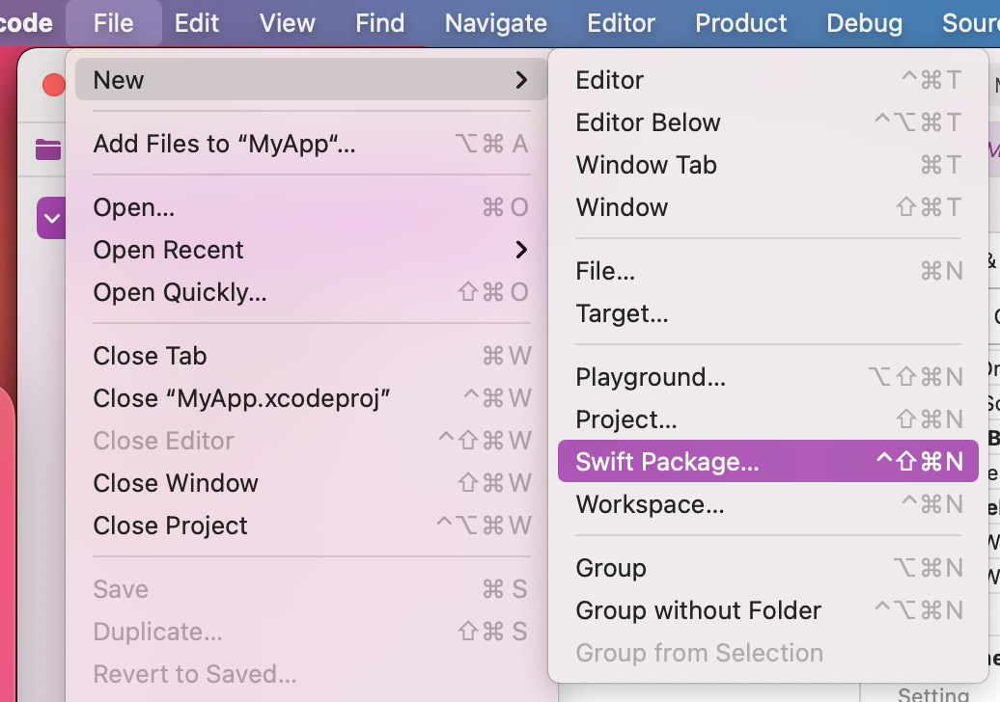
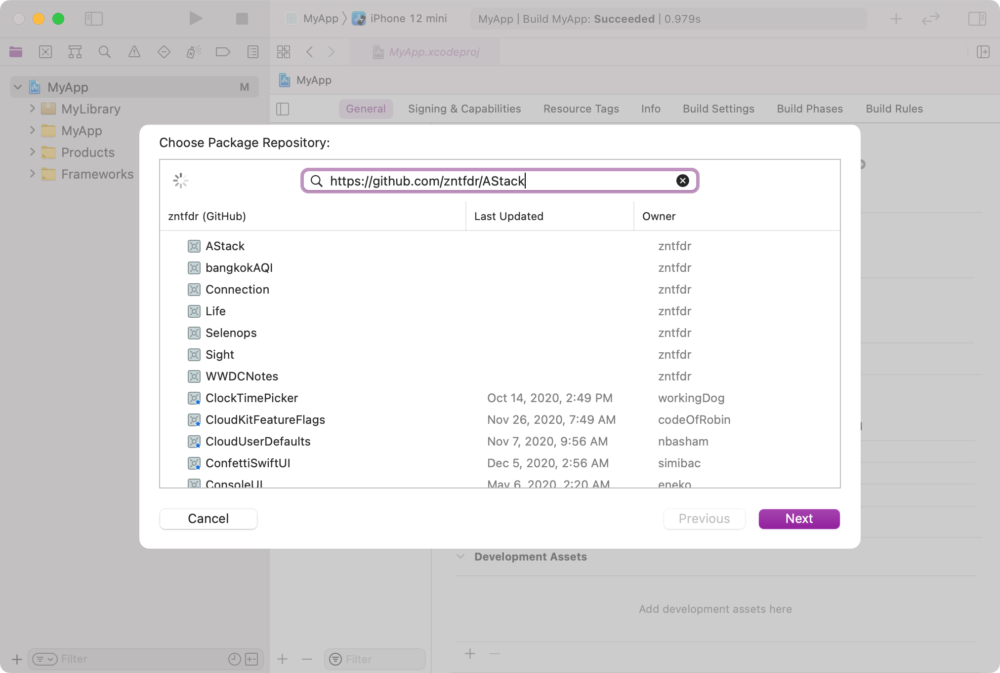

theme: Libre, 4
autoscale: true
build-lists: true

# [fit] Swift Package 
# [fit] all the things! 📦

## <br><br><br><br><br><br><br>

## __*Federico Zanetello*__

## ★★★★★ [**fivestars.blog**][fivestarsblog] *•* [**@zntfdr**][twitterHandle]

^Hi! My name is .. and I'm iOS Developer living and working here in 🇹🇭, in here it's ... which is well past my usual bed time, however today I'm very very pleased to be with all of you for this awesome conference.

^My presentation topic is Swift scripting, and you might be wondering, we're iOS Developers at UIKonf, ...

---

# [fit] What's a Swift Package?

- Reusable component
- Swift, Objective-C, Objective-C++, C, or C++
- Can bundle source files, binaries, assets

^in short it's the new way to build frameworks
^SPM has been out since 2015, last year iOS app support has been added

---

# [fit] Why should we use Swift Packages?

- modularization
- single-responsibility
- testability
- share between different projects/platforms
- blessed by 
- ...much more

---

# [fit] Getting 
# [fit] Started

^Time to get started!

---

# [fit] Create a Swift Package

1. Open your project
2. File > New > Swift Package...
3. Name it and add it to your project

---

# [fit] Create a Swift Package (1/2)



---

# [fit] Create a Swift Package (2/2)


---

# [fit] Done! 🤩


---

# [fit] Add Package to your App

1. Open app Project Editor 
2. Add the package under `Frameworks, Libraries, and Embedded Content`

^ At this point our Project navigator should look like this
^ Awesome! Now we have an app and a package, however we need to tell Xcode that we want to add this new package as a dependency to our app
^ From the `project navigator` click on the project name on the top left, which opens the `project editor` in the `editor area`.
^ In the editor area make sure to have selected the only target currently in the project and, under `Frameworks, Libraries, and Embedded Content` click the plus button as show in the slide
^ after clicking the plus button, select the library that we've just created and we're done!

---

# [fit] Add Package to your App (1/2)


---

# [fit] Add Package to your App (2/2)


---

# [fit] Done! 🤩


---

# The Package Structure

[.code-highlight: all]
^Once we execute the last command a bunch of files are created in the current directory, this is the complete structure.
I'm going to highlight the main components here.

[.code-highlight: 7-11]
^The `Tests` folder contains our test targets.

[.code-highlight: 4-6]
^The `Sources` folder contains our real targets. 

[.code-highlight: 5, 8]
^Each target representation is a folder:
all files within that folder belongs to that specific target, and every file can access to all other declarations within that folder.
^As you can see we have one target, hello, in our sources folder and one target, helloTests, in the test folders.

[.code-highlight: 2]
^Lastly, we have the most important file, the `Package.swift` declaration. Let's look at that.

```shell
├── .gitignore
├── Package.swift
├── README.md
├── Sources
│   └── MyLibrary
│       └── MyLibrary.swift
└── Tests
    ├── MyLibraryTests
    │   ├── MyLibraryTests.swift
    │   └── XCTestManifests.swift
    └── LinuxMain.swift
```

---

# Package.swift

[.code-highlight: all]
^The file is the manifest of our package.

^The Package.swift declares the whole package declaration.
^If something is not declared here, it doesn't exist. 

[.code-highlight: 6]
^we have the name

[.code-highlight: 8]
^then we have the products, declaration, which is what this package exposes

[.code-highlight: 10]
^Its dependencies.

[.code-highlight: 12-13]
^The package targets: A target is the basic building block of a Swift package.
^Each target contains a set of source files that are compiled into a module or test suite.
^A target may depend on other targets within the same package and on products vended by the package's dependencies.

^For example here we have our main target, that currently has no dependencies and has name `toolName`.

^Then we have a second, separate target for tests. This target depends on the package that we want to test.

```swift
// swift-tools-version:5.3

import PackageDescription

let package = Package(
  name: "MyLibrary",
  products: [
    .library(name: "MyLibrary", targets: ["MyLibrary"]),
  ],
  dependencies: [],
  targets: [
    .target(name: "MyLibrary", dependencies: []),
    .testTarget(name: "MyLibraryTests", dependencies: ["MyLibrary"]),
  ]
)
```

---

# The Package Structure

[.code-highlight: 6]
^Lastly, we have the most important file, the `Package.swift` declaration. Let's look at that.

```shell
├── .gitignore
├── Package.swift
├── README.md
├── Sources
│   └── MyLibrary
│       └── MyLibrary.swift
└── Tests
    ├── MyLibraryTests
    │   ├── MyLibraryTests.swift
    │   └── XCTestManifests.swift
    └── LinuxMain.swift
```

---

# MyLibrary.swift

```swift
struct MyLibrary {
    var text = "Hello, World!"
}
```

---

# MyLibrary.swift

[.code-highlight: all]

[.code-highlight: 3,5,7]
^remember to put public otherwise we cannot use it

[.code-highlight: all]

```swift
import SwiftUI

public struct MyCoolView: View {

  public init() {}
  
  public var body: some View {
    Text("This view is totally cool")
  }
}
```

---

# Package.swift

[.code-highlight: 7]
^By default Swift package support iOS 8

```swift
// swift-tools-version:5.3

import PackageDescription

let package = Package(
  name: "MyLibrary",
  platforms: [.iOS(.v13)],
  products: [
    .library(name: "MyLibrary", targets: ["MyLibrary"]),
  ],
  dependencies: [],
  targets: [
    .target(name: "MyLibrary", dependencies: []),
    .testTarget(name: "MyLibraryTests", dependencies: ["MyLibrary"]),
  ]
)
```

---

# MyLibrary.swift

[.code-highlight: all]

[.code-highlight: 3,5,7]
^remember to put public otherwise we cannot use it

[.code-highlight: all]

```swift
import SwiftUI

public struct MyCoolView: View {

  public init() {}
  
  public var body: some View {
    Text("This view is totally cool")
  }
}
```

^allright we can now go back to our view and everything will build fine
^But this view is a bit boring, what about adding an image?

---

# Add images

[.code-highlight: all]
[.code-highlight: 9]
^note that we need to specify the bundle or the image won't be found (unless the image is stored in the app instead of within the bundle)

```swift
import SwiftUI

public struct MyCoolView: View {

  public init() {}

  public var body: some View {
    VStack {
      Image("coolImage", bundle: .module)
      Text("This view is totally cool")
    }
  }
}
```

---

# The Package Structure

[.code-highlight: 6]
^All assets will be automatically visible within the module

```shell
├── .gitignore
├── Package.swift
├── README.md
├── Sources
│   └── MyLibrary
│       ├── Assets.xcassets
│       └── MyLibrary.swift
└── Tests
    ├── MyLibraryTests
    │   ├── MyLibraryTests.swift
    │   └── XCTestManifests.swift
    └── LinuxMain.swift
```

---

# Add localization

[.code-highlight: all]
[.code-highlight: 10]

```swift
import SwiftUI

public struct MyCoolView: View {

  public init() {}

  public var body: some View {
    VStack {
      Image("coolImage", bundle: .module)
      Text("cool_view_text", bundle: .module)
    }
  }
}
```

---

# Package.swift

[.code-highlight: 7]
^By default Swift package support iOS 8

```swift
// swift-tools-version:5.3

import PackageDescription

let package = Package(
  name: "MyLibrary",
  defaultLocalization: LanguageTag("en"),
  platforms: [.iOS(.v13)],
  products: [
    .library(name: "MyLibrary", targets: ["MyLibrary"]),
  ],
  dependencies: [],
  targets: [
    .target(name: "MyLibrary", dependencies: []),
    .testTarget(name: "MyLibraryTests", dependencies: ["MyLibrary"]),
  ]
)
```

---

# The Package Structure

[.code-highlight: 7-11]
^Lastly, we have the most important file, the `Package.swift` declaration. Let's look at that.

```shell
├── .gitignore
├── Package.swift
├── README.md
├── Sources
│   └── MyLibrary
│       ├── Assets.xcassets
│       ├── Localizations // 👈🏻 Arbitrary name
│       │   ├── en.lproj
│       │   │   └── Localizable.strings
│       │   └── th.lproj
│       │       └── Localizable.strings
│       └── MyLibrary.swift
└── Tests
    ├── MyLibraryTests
    │   ├── MyLibraryTests.swift
    │   └── XCTestManifests.swift
    └── LinuxMain.swift
```

---

# Testing a package

[.code-highlight: 15]
^By default Swift package support iOS 8

```swift
// swift-tools-version:5.3

import PackageDescription

let package = Package(
  name: "MyLibrary",
  defaultLocalization: LanguageTag("en"),
  platforms: [.iOS(.v13)],
  products: [
    .library(name: "MyLibrary", targets: ["MyLibrary"]),
  ],
  dependencies: [],
  targets: [
    .target(name: "MyLibrary", dependencies: []),
    .testTarget(name: "MyLibraryTests", dependencies: ["MyLibrary"]),
  ]
)
```

---

# Testing a package

[.code-highlight: 13-17]

```shell
├── .gitignore
├── Package.swift
├── README.md
├── Sources
│   └── MyLibrary
│       ├── Assets.xcassets
│       ├── Localizations
│       │   ├── en.lproj
│       │   │   └── Localizable.strings
│       │   └── th.lproj
│       │       └── Localizable.strings
│       └── MyLibrary.swift
└── Tests
    ├── MyLibraryTests
    │   ├── MyLibraryTests.swift
    │   └── XCTestManifests.swift
    └── LinuxMain.swift
```

---

# Testing a package

[.code-highlight: 13-17]

```shell
├── .gitignore
├── Package.swift
├── README.md
├── Sources
│   └── MyLibrary
│       ├── Assets.xcassets
│       ├── Localizations 
│       │   ├── en.lproj
│       │   │   └── Localizable.strings
│       │   └── th.lproj
│       │       └── Localizable.strings
│       └── MyLibrary.swift
└── Tests
    └── MyLibraryTests
        └── MyLibraryTests.swift
```

---

# Using our package

[.code-highlight: all]
[.code-highlight: 1, 6]

```swift
import MyLibrary
import SwiftUI

struct ContentView: View {
  var body: some View {
    MyCoolView()
  }
}
```

---

# [fit] Done! 🤩


---

# Adding an External Package

1. File > Swift Packages > Add Package Dependency
2. Insert dependency .git URL and follow wizard

---

# [fit] Adding an External Package (1/2)


---

# [fit] Adding an External Package (2/2)



---

# [fit] Done! 🤩


---

# [fit] Swift Package 
# [fit] all the things! 📦

## <br><br><br><br><br><br><br>

## __*Federico Zanetello*__

## ★★★★★ [**fivestars.blog**][fivestarsblog] *•* [**@zntfdr**][twitterHandle]

[fivestarsblog]: http://fivestars.blog/
[twitterHandle]: http://twitter.com/zntfdr