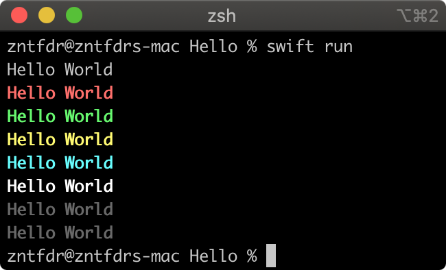

theme: Ostrich
autoscale: true
build-lists: true

# [fit] Swift Scripts:

# [fit] Zero to Hero 🦸🏼‍♀️

## <br>

## __*Federico Zanetello*__

★★★★★ [**fivestars.blog**][fivestarsblog] *•* [**@zntfdr**][twitterHandle]

---

# [fit] WHY? 🤔

^The main reasons for an iOS developer to write a swift script is familiarity: writing a script is very similar to write an app or a library. 
In fact we're going to build a script using SPM.

^Furthermore, if we're already writing in Swift, having to change to ruby, bash, python etc requires us to make a context switch, this might seem reasonable, however making this context switch everytime is not easy.

^And since we're all working in teams with multiple developers, just because one developer is fluent in python, this doesn't mean that other people in the team might be able to understand and/or even update the script if needed in the future. Using Swift is a safe bet.

---

# [fit] Getting Started

---

# Creating an executable

```shell
$ mkdir hello
$ cd hello
$ swift package init --type executable
```

^Note that creating a package from Xcode defaults to creating a library, not an executable.
^A target is considered as an executable if it contains a file named main.swift. The package manager will compile that file into a binary executable.

---

# The Package Structure

[.code-highlight: all]
^Once we execute the last command a bunch of files are created in the current directory, this is the complete structure.

[.code-highlight: 7-11]
^The `Tests` folder is where we will add our tests.

[.code-highlight: 4-6]
^The `Sources` folder is where our script code will be.

[.code-highlight: 1]
^The `.gitignore` is prefilled with directories that we should ignore when saving things on our repositories.

[.code-highlight: 3]
^The `README.md` is there for us to describe the package.

[.code-highlight: 2]
^Lastly, we have the most important file, the `Package.swift` declaration. Let's look at that.

```shell
├── .gitignore
├── Package.swift
├── README.md
├── Sources
│   └── hello
│       └── main.swift
└── Tests
    ├── helloTests
    │   ├── helloTests.swift
    │   └── XCTestManifests.swift
    └── LinuxMain.swift
```

---

# Package.swift

[.code-highlight: all]
^First of all, you can double click on this file to open the whole package in Xcode.
^The `Package.swift` is the manifest of our package, regardless of whether it's an executable, a library, a mix of those, or else.

^The Package type is used to configure the name, products, targets, dependencies and various other parts of the package.
^Even if it's a swift file, traditionally the properties of a Package are defined in the initializer statement, and not modified after initialization.

[.code-highlight: 1]
^The Swift tools version declares the version of the `PackageDescription` library, the minimum version of the Swift tools and Swift language compatibility version to process the manifest, and the minimum version of the Swift tools that are needed to use the Swift package. 
^Each version of Swift can introduce updates to the PackageDescription library, but the previous API version will continue to be available to packages which declare a prior tools version. This behavior lets you take advantage of new releases of Swift, the Swift tools, and the PackageDescription library, without having to update your package's manifest or losing access to existing packages.
^Even if this appears as a comment, this declaration is required as it states how to interpret the package:
^it's similar to how we have a `SWIFT_VERSION` key in our `XCBuildConfiguration` in our Xcode `.xcodeproj`.

[.code-highlight: 3]
^Then we have an import statement: The `PackageDescription` defines which APIs are available to the `Package.swift` file.

[.code-highlight: 5,17]
^Then we start with the actual package definition.

[.code-highlight: 6]
^We have the package name.

[.code-highlight: 7-8]
^Its dependencies.
^A package dependency typically consists of a Git URL to the source of the package, and a requirement for the version of the package. We will see an example later on.
^Dependencies declare other packages that this package depends on.
^`.package(url: /* package url */, from: "1.0.0"),`

[.code-highlight: 9, 16]
^The package targets: A target is the basic building block of a Swift package.
^Each target contains a set of source files that are compiled into a module or test suite.
^A target may depend on other targets within the same package and on products vended by the package's dependencies.

[.code-highlight: 10-12]
^For example here we have our main target, that currenly has no dependencies and has name `toolName`.

[.code-highlight: 13-15]
^Then we have a second, separate target for tests. This target depends on the package that we want to test.

^The difference between `.target`s and `.testTarget`s is that `.testTarget`s are not expected to have any headers. (you can see this by taking a look at `.testTarget` initializer that is missing the `publicHeadersPath` parameter, thet's the only difference as of now.

```swift
// swift-tools-version:5.1

import PackageDescription

let package = Package(
    name: "hello",
    dependencies: [
    ],
    targets: [
        .target(
            name: "hello",
            dependencies: []),
        .testTarget(
            name: "helloTests",
            dependencies: ["hello"]),
    ]
)
```

---

# main.swift

```swift
print("Hello, world!")
```

---

# Build Run Test

[.code-highlight: all]

[.code-highlight: 1]
^This will download, resolve and compile dependencies mentioned in the manifest file Package.swift.

[.code-highlight: 2]
^Since there is only one executable in this package, we can omit the executable name from the swift run command.
^Note that you don't have to build every time before running the script: swift run will also build the script if this hasn't been done

[.code-highlight: 3]
^and here's how to run the tests, note how it seems like at the moment we can specify a specific target, therefore we have to use a `--filter` flag that "Run test cases matching regular expression".

```shell
$ swift build # --target hello
$ swift run # hello
$ swift test # --filter helloTests
```

^Alternatively, you can do all of these also from Xcode, the main difference is that you'll need to make sure to set your mac as a Destination, or you won't be happy.

---

# [FIT] EXAMPLES

---

# Launch Input(s)

[.column]

[.code-highlight: all]
^If this is your first script, even if it's small there's a lot going on, so we will introduce every player one by one.

[.code-highlight: 6]
^First we have the CommandLine object, this is our script launch arguments container. 
^If you do UI Testing in your apps, you might have used them to pass flags into your app:
^```
^let app = XCUIApplication()
^app.launchArguments = ["UI-TESTING"]
^app.launch()
^```

[.code-highlight: 3-7]
^The first argument is always the script execution path: 
if we are reading the input sent along with the script, we want to get rid of this path and read only what's after that.

[.code-highlight: 1, 10]
^Then we have Darwin module, which is Apple’s UNIX-based core of every Apple OS. 
^You can think of it as the foundation of the Foundation framework.
^In this case I'm using it as it defines the two values for a succesful exit or, as the case here for an unsuccessful exit.
^You can also just type exit(0) for success and exit(1) for failure, I just try to avoid having undocumented magic numbers in the code.
^However this really means that our script never terminates until we tell it to do so, therefore **always** remember to terminate the script once your asynchronous call has been executed, or it will stay alive forever.
^Linux reserved exit codes: http://www.tldp.org/LDP/abs/html/exitcodes.html
^Note that this is just one of many ways that we can use to keep our script alive, other ways to do so is for example by using [semaphores](https://www.fivestars.blog/code/semaphores.html) or DispatchGroups.

[.code-highlight: all]
^Now that we have seen how it works, we can see the big picture..

```swift
import Darwin

let arguments: [String] = Array(
  // We drop the first argument, 
  // which is the script execution path.
  CommandLine.arguments.dropFirst()
)

guard let name: String = arguments.first else { 
  exit(EXIT_FAILURE) 
}

print("Hello \(name)")
```

[.column]

```shell
$ swift run hello World
> Hello World
```

---

# Interactive

[.column]

[.code-highlight: all]

[.code-highlight: 6]
^returns a string read from standard input through the end of the current line or until EOF is reached.
^This line is synchronous, and your script will continue running after the user has hit the return key.

[.code-highlight: all]

```swift
import Darwin

print("What's your name?")

guard
  let name = readLine(),
  !name.isEmpty else {
    exit(EXIT_FAILURE)
}

print("Hello \(name)")
```

[.column]

```
$ swift run hello
> What's your name?
> World
> Hello World
```

---

# Pipeline Messages

[.column]

[.code-highlight: all]
^In case we need to work with pipelines, then we can use Foundation's FileHandle.

[.code-highlight: 3, 6]
^as the name says, it handles objects to access data associated with files, sockets, pipes, and devices.
^In our case we use it to get the `standardInput` terminal, and then read the available data at launch.

[.code-highlight: all]
^Note that this specific script expects data once launched, if there's no data, 
^it's going to hang until data is given to the script.

```swift
import Foundation

let standardInput: FileHandle = .standardInput

if let inputString = String(
  data: standardInput.availableData,
  encoding: .utf8
) {
  print(inputString)
}
```

[.column]

```shell
$ ls -1 | swift run hello
> Package.swift
> README.md
> Sources
> Tests
```

---

# Asynchronous Calls

[.code-highlight: all]
^One of the first needs that I had when I got started with scripts was doing things asynchonously.
^In this first example we're fetching something from the internet.
^In an app we just call things like `DispatchQueue.main.async` and we're good, as our app stays alive even when we're not executing anything.
^However in the executable world our script life ends as soon as we reach the end of the file. Unless...

[.code-highlight: 9,12,16]
^we run this command here.
^In short what this command does is to tell the current thread to wait for inputs from its loop, making it so that it doesn't terminate immediately.

[.code-highlight: all]
^Note how in here we have imported `Foundation`: all the system frameworks are available to us without the need to add them in our `Package.swift` file!

```swift
import Foundation

let url: URL = URL(string: "https://api.github.com/users/zntfdr")!
let request = URLRequest(url: url)
URLSession.shared.dataTask(with: request) { data, _, error in
  if let data = data {
    let responseText = String(data: data, encoding: .utf8)!
    print(responseText)
    exit(EXIT_SUCCESS)
  } else {
    print(error!.localizedDescription)
    exit(EXIT_FAILURE)
  }
}.resume()

RunLoop.current.run()
```

---

SwiftToolsSupport's
# [fit] TSCUtility 
# [fit] & TSCBasic

^Previously known as SPMUtility & Basic
^Tools-Support-Core
^They offer an abstractions for common operations.
^Eventually TSCUtility functions will migrate to TSCBasic.
^These libraries come under an umbrella called SwiftToolsSupport.

---

# Adding a Dependency

[.code-highlight: 4-5, 10]

```swift
let package = Package(
    name: "hello",
    dependencies: [
        .package(url: "https://github.com/apple/swift-tools-support-core.git",
                 from: "0.0.1"),
    ],
    targets: [
        .target(
            name: "hello",
            dependencies: ["SwiftToolsSupport"]),
        .testTarget(
            name: "helloTests",
            dependencies: ["hello"]),
    ]
)
```

---

# Parse Arguments

[.column]

[.code-highlight: all]
^This is the most complex example of the whole presentation please bare with me.
^Previously we saw how to parse a single input. Which was nice and easy, however if you used any other command line tool before you know that most of them come with an help, and you can pass multiple parameters and flags to them.
This is exactly what the `ArgumentParser` is for.
^In this example we just ask for the user name, however you can easily imagine how much more complicated you can make this.

[.code-highlight: 1,2]
^First of all, as promised, these are the two libraries that we've just added as a depenency.

[.code-highlight: 8-10]
^In here we define our parser, which we can think of our command line interface to the user.

[.code-highlight: 12-14]
^In this case I'm asking the user to pass the name via a value argument identified with the `--name` flag.
^Note that in here I'm already telling the parser which type I'm expecting to get back.
^In this case I'm using a primitive however, like for `Decodable`, we can also make our own types parsable, and this is done by making our types conform to the `ArgumentKind` protocol.

[.code-highlight: 16-22]
^Lastly in here we're doing the actual parsing and then print the outcome

[.code-highlight: all]
^Note how, in case of any failure, I'm telling the parser to print the command line usage. This is done for free with our utilities, we don't have to do anything to get this behaviour.

```swift
import TSCBasic
import TSCUtility

let arguments: [String] = Array(
  CommandLine.arguments.dropFirst()
)

let parser = ArgumentParser(
  usage: "--name YourName",
  overview: "Tell me your name 😊")

let nameArgument: OptionArgument<String> = parser.add(
  option: "--name",
  kind: String.self)

let parseResult = try! parser.parse(arguments)
if let name: String = parseResult.get(nameArgument) {
  print("Hello \(name)")
} else {
  parser.printUsage(on: stdoutStream)
}
```

[.column]

```shell
$ swift run hello --name World
> Hello World

$ swift run hello
> OVERVIEW: Tell me your name 😊
> 
> USAGE: hello --name YourName
> 
> OPTIONS:
>   --help   Display available options
```

---

# Loading State

[.code-highlight: all]
^Like in our apps, even on the command line we do not want to completely block the interface when we're doing some heavy lifting.
^Sometimes for scripts this is not possible, as in, we need to finish the work we're currently doing before the user can continue its flow.
^However, leaving the terminal completely still while we're doing so it's not the best user experience, the user might think that the script is stuck or something.
^To address this issue we can use one of the many loading states animations that `TSCUtility` gives us, here's an example.

[.code-highlight: 5-7]
^In here we define this animation, again this is not the only one that we have.

[.code-highlight: 12-14]
^In here we update it. Note how we don't need to worry about the presentation at all, in here we just tell at which step we're currently out of how many, and that's all, `TSCUtility` will take care of the rest for us.

[.code-highlight: 16]
^Lastly, we call animation complete when the work is done.

[.code-highlight: all]

[.column]

```swift
import Darwin
import TSCBasic
import TSCUtility

let animation = PercentProgressAnimation(
  stream: stdoutStream,
  header: "Hello World")

for i in 0..<100 {
  let second: Double = 1_000_000
  usleep(UInt32(second * 0.05))
  animation.update(step: i,
                   total: 100,
                   text: "Loading..")
}
animation.complete(success: false)
```

[.column]


---

# Colors

[.column]

[.code-highlight: all]
^And of course we need colors to make our script pretty.
^The way to do so takes a few steps more than just a standard print, however you please feel free to create your own wrapper around it if you'd like to.
^Here's how to do it:

[.code-highlight: 3-5]
^First of all, we need to create a `TerminalController`, this, as the name says, controls the terminal. It allows operations like cursor movement and colored text output on.

[.code-highlight: 7-10]
^The colors that `TSCBasic` offer us are limited, I suspect these are the standard colors for all scripts, but I might be wrong. 

[.code-highlight: 13-17]
^Lastly, here's how we print our message in the command line, note how we can also specify the font weight.
^When we write to the terminal we're just writing to it, it doesn't end the line, so we must do so ourselves by calling `endLine()`.

[.code-highlight: all]

```swift
import TSCBasic

let terminalController = TerminalController(
  stream: stdoutStream
)

let colors: [TerminalController.Color] = [
  .noColor, .red, .green, .yellow, 
  .cyan, .white, .black, .grey
]

for color in colors {
  terminalController?.write(
    "Hello World", 
    inColor: color, 
    bold: true)
  terminalController?.endLine()
}
```

[.column]



---

# [fit] Release 

---

# Use the script from anywhere

```shell
$ swift build -c release
$ cd .build/release
$ cp Hello /usr/local/bin/hello


$ hello #from anywhere
```

---

# [fit] Evolution

---


---

# [fit] Links

Resources:
[github.com/**apple/swift-package-manager**](https://github.com/apple/swift-package-manager)
[github.com/**apple/swift-tools-support-core**](https://github.com/apple/swift-tools-support-core/)
[**rderik.com**/blog/command-line-argument-parsing-using-swift-package-manager-s](https://rderik.com/blog/command-line-argument-parsing-using-swift-package-manager-s/)

---

# [fit] Swift Scripts:

# [fit] Zero to Hero 🦸🏼‍♀️

## <br>

## __*Federico Zanetello*__

★★★★★ [**fivestars.blog**][fivestarsblog] *•* [**@zntfdr**][twitterHandle]

[fivestarsblog]: http://fivestars.blog/
[twitterHandle]: http://twitter.com/zntfdr