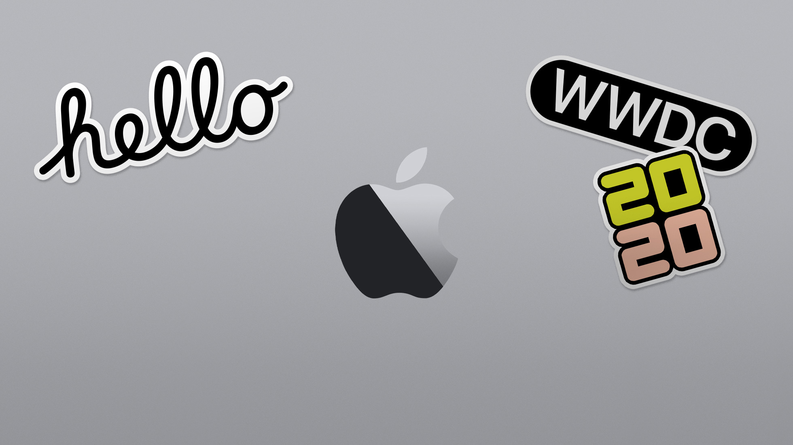

theme: Letters from Sweden, 4
autoscale: true
build-lists: true

# [fit] *What's New in*

# [fit] *Swift* _**5.3**_

## <br>
## __*Federico Zanetello*__

★★★★★ [_fivestars.blog_](http://fivestars.blog) *•* [_@zntfdr_](http://twitter.com/zntfdr)

---



---

# [fit] Swift 
# [fit] Evolution

^Swift is growing and evolving, guided by a community-driven process referred to as the "Swift Evolution" process.
Swift Evolution is the process used by the Swift Community to bring new features and changes into the language.

<!--
---

# [SE-0270](https://github.com/apple/swift-evolution/blob/master/proposals/0270-rangeset-and-collection-operations.md)
__Add Collection Operations on Noncontiguous Elements__
_Welcome RangeSet!_

```swift
var numbers = Array(1...15)

// Find the indices of all the even numbers
let indicesOfEvens = numbers.subranges(where: { $0.isMultiple(of: 2) })

// Perform an operation with just the even numbers
let sumOfEvens = numbers[indicesOfEvens].reduce(0, +)
// sumOfEvens == 56

// You can gather the even numbers at the beginning
let rangeOfEvens = numbers.moveSubranges(indicesOfEvens, to: numbers.startIndex)
// numbers == [2, 4, 6, 8, 10, 12, 14, 1, 3, 5, 7, 9, 11, 13, 15]
// numbers[rangeOfEvens] == [2, 4, 6, 8, 10, 12, 14]
```

^Range<Index> to refer to a group of consecutive positions in a collection
^RangeSet<Index> to refer to discontiguous positions in an arbitrary collection
-->
---

# [SE-0269](https://github.com/apple/swift-evolution/blob/master/proposals/0269-implicit-self-explicit-capture.md)
__Increase availability of implicit self in @escaping closures when reference cycles are unlikely to occur__
_No more self. self. self._

[.column]

```swift
// Reference type
class Executor {
  var value: Int = 0
  func doSomething() {
    asyncWork { [self] in
      value = 3 // No need of self.
    }
  }

  func asyncWork(
    completion: @escaping () -> Void) {
    ...
  }
}
```

[.column]

```swift
// Value type
struct ContentView: View {
  @State var taps: Int = 0

  var body: some View {
    Button(action: {
      taps += 1 // No need of self.
    }) {
      Text("Tap me")
    }
  }
}
```

^

---

# [SE-0266](https://github.com/apple/swift-evolution/blob/master/proposals/0266-synthesized-comparable-for-enumerations.md)
__Synthesized Comparable conformance for enum types__
_*No enum types with raw values tho_

[.column]

```swift
enum Outcome: Comparable {
  case low, mid, high
}

let arr: [Outcome] = [
  .mid, .high, .mid, .low
]
arr.sorted() 
// ^ [.low, .mid, .mid, .high]
```

[.column]

```swift
enum Position: Comparable {
  case first(Int), second(Double)
}

let arr: [Position] = [
  .first(2000), .second(0.5), 
  .first(400), .second(1.0)
]

arr.sorted() 
// ^ [
  .first(400), .first(2000), 
  .second(0.5), .second(1.0)
]
```

^

---


# [SE-0267](https://github.com/apple/swift-evolution/blob/master/proposals/0267-where-on-contextually-generic.md)
__where clauses on contextually generic declarations__
_no need to put these declarations on extensions any longer!_

```swift
struct Box<Wrapped> {
  func boxes() -> [Box<Wrapped.Element>] where Wrapped: Sequence { ... }
  //                                      ^ New in Swift 5.3
}

// Swift 5.2 <= approach:
struct Box<Wrapped> {}

extension Box where Wrapped: Sequence {
  func boxes() -> [Box<Wrapped.Element>] { ... }
}
```

^'where' clause cannot be attached error will be relaxed for most declarations nested inside generic contexts
^Non-generic members that support a generic parameter list, including nested type declarations, are now allowed to carry a contextual where clause against outer generic parameters.

---


# [SE-0280](https://github.com/apple/swift-evolution/blob/master/proposals/0280-enum-cases-as-protocol-witnesses.md)
__Enum cases as protocol witnesses__
_Enum cases can now satisfy static protocol requirements_

```swift
protocol P {
  static var foo: Self { get }
  static func bar(value: Int) -> Self
}

enum E: P {
  case foo // matches 'static var foo'
  case bar(value: Int) // matches 'static func bar(value:)'
}
```

^

---

# [SE-0276](https://github.com/apple/swift-evolution/blob/master/proposals/0276-multi-pattern-catch-clauses.md)
__Multi-Pattern Catch Clauses__
_Paving the road for typed throws_

```swift
do {
  try performTask()
} catch TaskError.someRecoverableError { // Swift <= 5.2
  ...
} catch TaskError.someFailure(let msg),
        TaskError.anotherFailure(let msg) { // New in Swift 5.3
  ...
}
```

^

---

# [SE-0268](https://github.com/apple/swift-evolution/blob/master/proposals/0268-didset-semantics.md)
__Refine didSet Semantics__
_more efficient didSet property observers 🏎_

[.column]

```swift
class Foo {
  var bar = 0 {
    didSet { print("didSet called") }
  }

  var baz = 0 {
    didSet { print(oldValue) }
  }
}

let foo = Foo()
foo.bar = 1 // Won't fetch oldValue.
foo.baz = 2 // Will fetch oldValue.
```

[.column]

```swift
class Foo2 {
  var bar = 0 {
    // When willSet isn't declared, 
    // in-place modifications are allowed.
    didSet { bar += bar }
  }
}

let foo = Foo()
foo.bar = 1 // foo.bar = 2
foo.bar = 7 // foo.bar = 8
```

^

---

# [SE-0277](https://github.com/apple/swift-evolution/blob/master/proposals/0277-float16.md)
__Float16__
_Say hello to Float16_

```swift
@available(macOS 10.16, iOS 14, tvOS 14, watchOS 7, *)
@frozen
public struct Float16: BinaryFloatingPoint, SIMDScalar, CustomStringConvertible { }
```

^The last decade has seen a dramatic increase in the use of floating-point types smaller than (32-bit) Float. The most widely implemented is Float16, which is used extensively on mobile GPUs for computation, as a pixel format for HDR images, and as a compressed format for weights in ML applications.

^Introducing the type to Swift is especially important for interoperability with shader-language programs; users frequently need to set up data structures on the CPU to pass to their GPU programs. Without the type available in Swift, they are forced to use unsafe mechanisms to create these structures.

---

# [SE-0281](https://github.com/apple/swift-evolution/blob/master/proposals/0281-main-attribute.md)
__@main: Type-Based Program Entry Points__
_Preferred execution entry point definition_

[.column]

```swift
struct MyProgram: ApplicationRoot {
    public static func main() {
        // ...
    }
}

MyProgram.main()
```

```swift
@main 
struct MyProgram: ApplicationRoot {
    public static func main() {
        // ...
    }
}
```

[.column]


^Swift programs start execution at the beginning of a file. 
^@main have a single implicit requirement: declaring a static main() method
^The compiler will ensure that the author of a program only specifies one entry point. One unique entrypoint
^@main can be applied to either a type declaration or to an extension of an existing type. The @main-designated type can be declared in the application target or in an imported module. @main can be applied to the base type of a class hierarchy, but is not inherited — only the specific annotated type is treated as the entry point.

---

# [SE-279](https://github.com/apple/swift-evolution/blob/master/proposals/0279-multiple-trailing-closures.md)
__Multiple Trailing Closures__
_Write even less code_

[.column]

```swift
UIView.animate(withDuration: 0.3, animations: {
  self.view.alpha = 0
}, completion: { _ in
  self.view.removeFromSuperview()
})
```

[.column]

```swift
UIView.animate(withDuration: 0.3) {
  self.view.alpha = 0
} completion: { _ in
  self.view.removeFromSuperview()
}
```

^
- The first trailing closure drops its argument label (like today).
- Subsequent trailing closures require argument labels.

<!-- spm SE
---

# [SE-0278](https://github.com/apple/swift-evolution/blob/master/proposals/0278-package-manager-localized-resources.md)
__Package Manager Localized Resources__
_TODO_

```swift

```

^

---

# [SE-0273](https://github.com/apple/swift-evolution/blob/master/proposals/0273-swiftpm-conditional-target-dependencies.md)
__Package Manager Conditional Target Dependencies__
_TODO_

```swift

```

^

---

# [SE-0272](https://github.com/apple/swift-evolution/blob/master/proposals/0272-swiftpm-binary-dependencies.md)
__Package Manager Binary Dependencies__
_TODO_

```swift

```

^

---

# [SE-0271](https://github.com/apple/swift-evolution/blob/master/proposals/0271-package-manager-resources.md)
__Package Manager Resources__
_TODO_

```swift

```

^
-->
---

# [SE-0263](https://github.com/apple/swift-evolution/blob/master/proposals/0263-string-uninitialized-initializer.md)
__Add a String Initializer with Access to Uninitialized Storage__
_Performance Boost with a new String initializer_

```swift
extension String {
  public init(
    unsafeUninitializedCapacity capacity: Int,
    initializingUTF8With initializer: (
      _ buffer: UnsafeMutableBufferPointer<UInt8>,
    ) throws -> Int
  ) rethrows
}
```

^Used in lowercased uppercased, also when bridging NSString and the likes, also public

---

# [SE-0]()
__title__
_comment_

```swift

```

^

---

# [fit] Swift 
# [fit] Report

---

# [SR-75](https://bugs.swift.org/browse/SR-75)
__Referencing a protocol function crashes the compiler__
_partially-applied method references now behave as normal closures_

```swift
protocol Cat {
  func play(catToy: Toy)
}

let fn = Cat.play(catToy:) // = { (cat: Cat) in cat.play(catToy:) }
fn(myCat)(myToy)
```

^Filed on December 2015

---

# [SR-11700](https://bugs.swift.org/browse/SR-11700)
__Diagnose exclusivity violations with Dictionary.subscript._modify__
_can't write bad code anymore!_

```swift
struct Container {
   static let defaultKey = 0

   var dictionary = [defaultKey:0]

   mutating func incrementValue(at key: Int) {
     dictionary[key, default: dictionary[Container.defaultKey]!] += 1
                                        ^ 
    // error: overlapping accesses to 'self.dictionary', but modification requires exclusive access
   }
}
```

^We shouldn't access to the dictionary in the `default` argument when assigning. Modification requires exclusive access.

---

# [SR-7083](https://bugs.swift.org/browse/SR-7083)
__lazy properties can't have observers__
_willSet and didSet ❤️ lazy_

```swift
class C {
  lazy var property: Int = 0 {
    willSet { print("willSet called!") } // Okay
    didSet { print("didSet called!") } // Okay
  }
}
```

^

---

# [SR-]()
__title__
_comment_

```swift

```

^

---

# [fit] & More!
*Function Builders ❤️

---

# [#30045](https://github.com/apple/swift/pull/30045)
__Support if let / if case in function builders.__

```swift
struct ContentView: View {

  var body: some View {
    if let ... {
      ...
    }
    if case let ... {
      ...
    }
  }
}
``` 

---

# [#29409](https://github.com/apple/swift/pull/29409)
__Support multiple Boolean conditions in 'if' statements.__

```swift
struct ContentView: View {

  var body: some View {
    if a, 
       b, 
       c { 
      ... 
    }
  }
}
``` 

---

# [#30174](https://github.com/apple/swift/pull/30174)
__Implement switch support for function builders.__

```swift
struct ContentView: View {

  var body: some View {
    switch ... {
      case ...
      case ...
    }
  }
}
```

---

# [#29419](https://github.com/apple/swift/pull/29419)
__[Function builders] Add support for "if #available"__

```swift
struct ContentView: View {

  var body: some View {
    if #available(OSX 10.51, *) {
      ...
    }
  }
}
```

---

# [#28606](https://github.com/apple/swift/pull/28606)
__[Function builders] Handle #warning and #error__

```swift
struct ContentView: View {

  var body: some View {
    #warning("🤫")
    ...
    #error("💥")
  }
}
```

---

# [#29786](https://github.com/apple/swift/pull/29786)
__Allow initialized let/var declarations in function builders__

```swift
struct ContentView: View {

  var body: some View {
    let a = ...
    ... // no need return
  }
}
```

---

# [fit] Demo time 🤩

---

# [fit] Toolchain 🔗

[swift.org/_download/_](https://swift.org/download/)

- Compiler
- Indexer
- Debugger

^ A tool chain is a set of tools that Xcode needs to build and debug code
^ https://swift.org/download/#snapshots

---

# [fit] Standard Library 
# [fit] Preview Package 📦

[github.com/_apple/swift-standard-library-preview_](https://github.com/apple/swift-standard-library-preview)

- Swift Package
- Doesn't preview 100% of what's new
- Can release apps with it

---

# [fit] Links

Resources:
[_github.com/apple/swift-evolution_](https://github.com/apple/swift-evolution)
[_github.com/apple/swift_](https://github.com/apple/swift)
[_forums.swift.org_](https://forums.swift.org)

Slides Style:
[_jessesquires.com_](http://jessesquires.com) *•* [_@jesse\_squires_](https://twitter.com/jesse_squires)

---

# [fit] *What's New in*

# [fit] *Swift* _**5.3**_

## <br>
## __*Federico Zanetello*__

★★★★★ [_fivestars.blog_](http://fivestars.blog) *•* [_@zntfdr_](http://twitter.com/zntfdr)