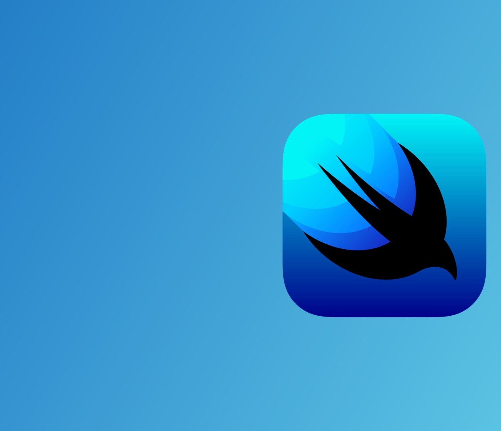
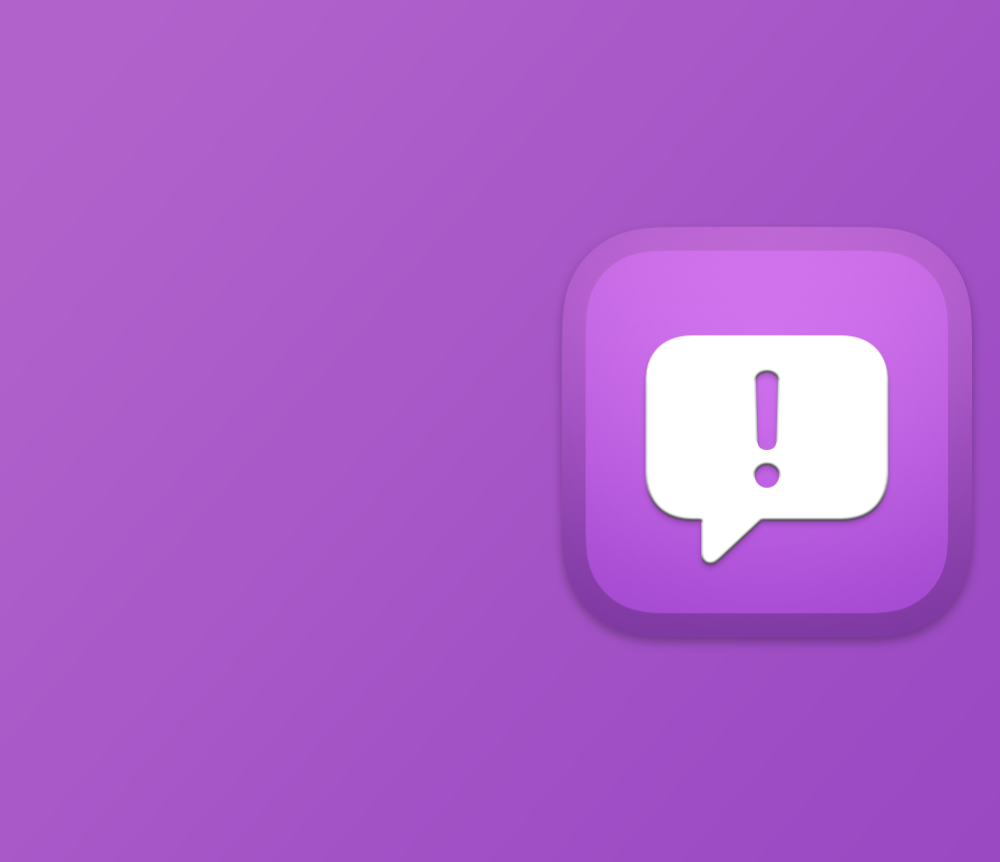

theme: Letters from Sweden, 5
autoscale: true
build-lists: false

# [fit] *SwiftUI*
# [fit] _**Lessons**_



## <br>
## __*Federico Zanetello*__

★★★★★ [_fivestars.blog_](http://fivestars.blog) *•* [_@zntfdr_](http://twitter.com/zntfdr)

[.header-strong: #000]
[.text-emphasis: #000]
[.text-strong: #000]
[.text: #000]
[.header-emphasis: #ffffff]

^Hello everyone my name is .. and I'm the creator of fivestars.blog.
^In my website I take deep dives into inner workings and behind the scenes of what is Swift and iOS development today.
^In this talk I'd like to take a different path, and instead, share with you some of the lessons I've learned during the past three years in building and shipping SwiftUI apps. Coming from a UIKit background.

<!-- most importantly for this talk, I've been shipping SwiftUI apps since the day iOS 13 came out, with navigation, deep link and many other feature users expect from any modern app.
 -->

^Let's get started!

---

<!-- Lesson 1 -->

# [fit] SwiftUI
# [fit] is *not*
# [fit] UIKit 2

^The first lesson is that..
^throw away your decade of experience
^hard truth is “seniors” have forgotten to keep learning
^to this day I receive applicants that use 7 years old collection apis instead of the 3 years old snapshots
^It's a clear departure.

---

[.text: #fff, text-scale(1.5)]

# New way to make changes via state

- @State 
- @StateObject
- @EnvironmentObject

^SwiftUI is state driven, it automatically observe changes for us

---

[.text: #fff, text-scale(1.5)]

# New View communication

- Bindings
- SwiftUI Environment
- Closures

<!-- # [fit] *State* 
# is the new king -->

^When learning SwiftUI from a UIKit background, one of the most perplexing and probably baffling challenges to learn/understand is how to make 
^how to make views change based on events happening on the view model:  
in SwiftUI a view model can't just reach for the view and change its properties for example. Instead, the view <-> view-model communication happens via changes of states, 

^instead of having view models telling views to change their color, the model will change its own state that is then observed by the view.
^Communication is just one of the many aspects that has completely evolved with SwiftUI.

^all of these concepts are foreign to anyone coming from UIKit
^It goes without saying but...

---

# [fit] It’s *expected* 
# [fit] to *struggle* when 
# [fit] moving to SwiftUI

^If you're not struggling, you're probably doing it wrong
^This is such an important point that I've made a slide to further enphatized it.
^It’s like somebody fluent in one language is surprised that it cannot be as fluent in another one. 
^Yes, they share some grammars 
^SwiftUI doesn’t care about your 10 years of experience in UIKit
^When people say that something is impossible in SwiftUI, it means they haven’t figured it out and give up. 

---

<!-- Lesson 2 -->

# [fit] *Everything* 
# [fit] is a `View`,
# [fit] *not every `View`*
# [fit] is a view. 

^Think like flow stacks as coordinator, containers..

---

[.text: #fff, text-scale(1.5)]

# Events are observed and delivered to views

[.column]

- `onAppear`
- `onDisappear`
- `task`
- `onReceive`
- `onChange`

[.column]

- `onDrag`
- `onDrop`
- `onHover`
- `onSubmit`
- …

^(for the first point) there's no delegate,
^this comes as perplexing and, sometimes, even upsetting, but most business logic happens in views.
^Most key events are delivered to views

---

# `View`s can be containers[^2]

[.code: auto(1)]

```swift
struct FSView: View {
  @StateObject var model = FSModel()

  var body: some View {
    FSList(elements: model.elements) // Actual UI
      .onAppear(perform: model.onAppear) 
      // 👆🏻 forwards business logic to the view model
  }
}
```

[^2]: https://swiftwithmajid.com/2019/07/31/introducing-container-views-in-swiftui/

---

[.code: auto(1), text-scale(1.5)]

# SwiftUI coordinator architecture[^1]

```swift
struct FlowCoordinator: View {
  @State private var flow = NFlow<Screen>(root: .firstScreen)
  var onCompletion: () -> Void

  var body: some View {
    NStack($flow) { screen in
      switch screen {
        case .firstScreen:
          FirstScreen(onCompletion: { flow.push(.secondScreen) })
        case .secondScreen:
          SecondScreen(onCompletion: onCompletion)
      }
    }
  }
}
```

[^1]: https://github.com/johnpatrickmorgan/FlowStacks

---

# [fit] SwiftUI is 
# [fit] _slow_

^if we’re not careful. 
^Use your architecture or the Observing repository to avoid doing stuff
^SwiftUI is lazy, it won’t compute things unless we ask for, e.g. think preference keys propagation

---

[.text: #fff, text-scale(1.5)]

- The more parameters/states/dependencies, the more trouble[^1]
- Isolate state as much as possible[^2]
- Have each view observe as little as possible[^3]

[^1]: https://www.fivestars.blog/articles/app-state/

[^2]: https://www.wwdcnotes.com/notes/wwdc21/10022/

[^3]: https://github.com/cookednick/Observable

---

# [fit] Feedback ⠀⠀⠀⠀⠀
# [fit] Assistant[^1] ⠀⠀⠀⠀ ⠀
# [fit] is your ⠀⠀ ⠀⠀
# [fit] *new friend* ⠀ ⠀⠀




[^1]: https://feedbackassistant.apple.com

^The SwiftUI team listens to the community feedback, I've never received as many responses to all my feedback as after SwiftUI

---

[.background-color: #ae52d8]
[.text: #fff, text-scale(1.5)]

# Feedback Assistant pro tips

- File as many feedbacks as possible
- File as early as possible (during beta period)
- Describe your scenario (for suggestions)
- Add reproduction code (for bugs)

---

# [fit] Is SwiftUI 
# [fit] *production ready*? 

---

# [fit] Are *you*? 

---

# [fit] *SwiftUI*
# [fit] _**Lessons**_


## <br>
## __*Federico Zanetello*__

★★★★★ [_fivestars.blog_](http://fivestars.blog) *•* [_@zntfdr_](http://twitter.com/zntfdr)

[.header-strong: #000]
[.text-emphasis: #000]
[.text-strong: #000]
[.text: #000]
[.header-emphasis: #ffffff]

<!-- 
More ideas:

- To truly understand SwiftUI, you need to truly understand Swift. Property wrappers, async/await, callable as function in env values

- We don’t set or change how things look/behave. Instead we change their declarate
- Overlay/background are your friends, Spacer + stacks are enemies
- Everything is a state, SwiftUI changes 
- Create raw views to avoid unnecessary redraws when a @State/etc will trigger the body redraw will be triggered,
 -->